# 기술 아키텍처 다이어그램

**버전**: 1.0
**작성일**: 2026-02-11
**작성자**: 기술 아키텍처팀
**상태**: MVP 개발 진행 중

---

## 1. 전체 시스템 아키텍처

### 1.1 3계층 아키텍처 개요

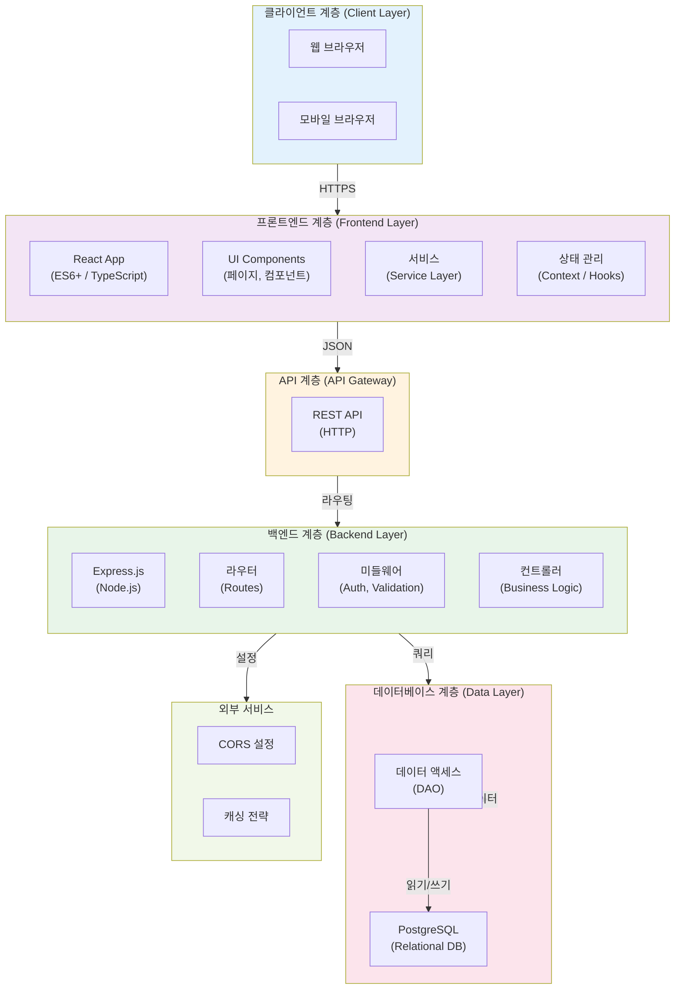

---

## 2. 프론트엔드 아키텍처

### 2.1 프론트엔드 계층 상세 구조

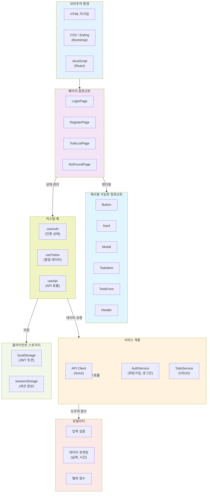

### 2.2 프론트엔드 데이터 흐름

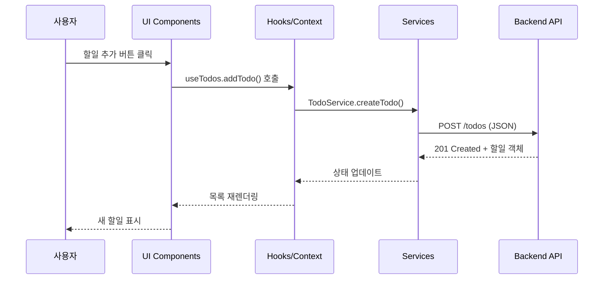

### 2.3 기술 스택 (프론트엔드)

| 계층 | 기술 | 용도 | 버전 |
|------|------|------|------|
| **런타임** | JavaScript / TypeScript | 언어 | 5.x |
| **UI 프레임워크** | React | UI 라이브러리 | 19 |
| **라우팅** | React Router | 페이지 네비게이션 | 6.x |
| **HTTP 클라이언트** | Axios | API 호출 | 1.x |
| **상태 관리** | Context API / Hooks | 전역 상태 | 내장 |
| **UI 프레임워크** | Bootstrap | CSS 프레임워크 | 5.x |
| **번들러** | Vite | 빌드 도구 | 5.x |
| **패키지 관리** | npm | 의존성 관리 | - |

---

## 3. 백엔드 아키텍처

### 3.1 백엔드 계층 상세 구조

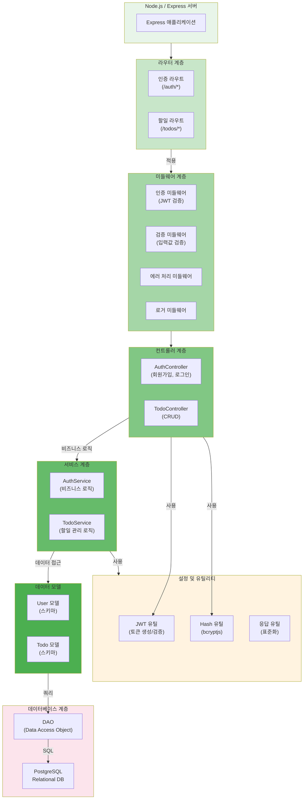

### 3.2 백엔드 요청 처리 흐름

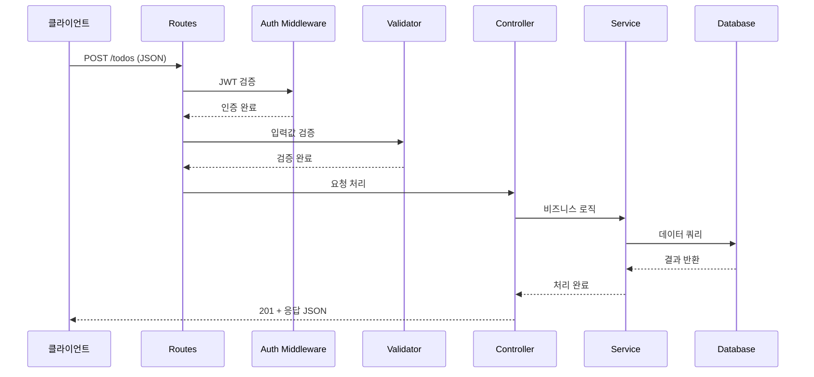

### 3.3 기술 스택 (백엔드)

| 계층 | 기술 | 용도 | 버전 |
|------|------|------|------|
| **런타임** | Node.js | 실행 환경 | >= 22.0.0 |
| **웹 프레임워크** | Express.js | 라우팅 및 미들웨어 | 4.x |
| **데이터베이스** | PostgreSQL | 관계형 DB | 17 |
| **DB 드라이버** | pg | PostgreSQL 연결 | 8.x |
| **비밀번호 해시** | bcryptjs | 보안 | 2.x |
| **JWT 토큰** | jsonwebtoken | 인증 | 9.x |
| **환경 변수** | dotenv | 설정 관리 | 16.x |
| **트랜스파일러** | @babel/core | ES6+ 변환 | 7.x |
| **번들러** | webpack | 빌드 도구 | 5.x |
| **패키지 관리** | npm | 의존성 관리 | - |

---

## 4. 데이터베이스 아키텍처

### 4.1 데이터베이스 스키마

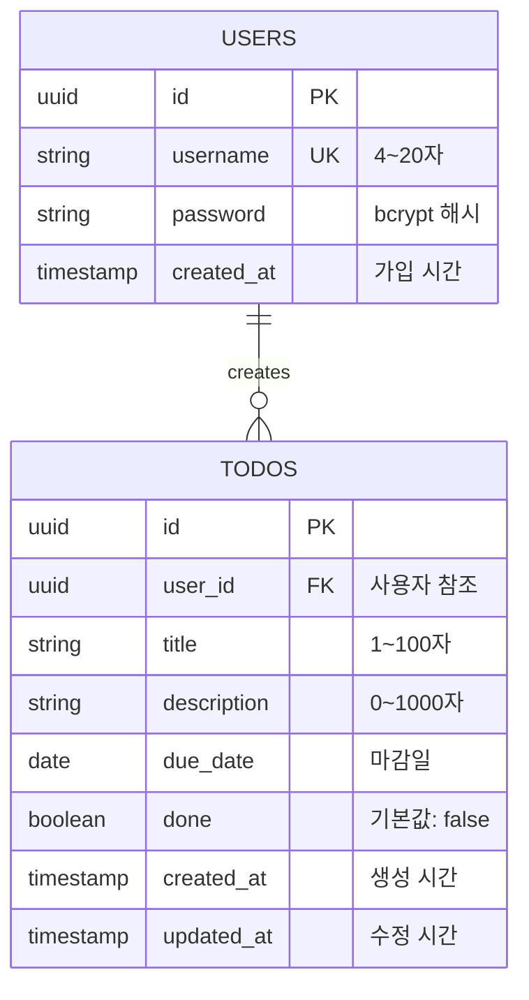

### 4.2 데이터베이스 테이블 설명

#### Users 테이블
- **id**: UUID (Primary Key, 고유 식별자)
- **username**: VARCHAR(20), UNIQUE (로그인 아이디)
- **password**: VARCHAR(255) (bcrypt 해시화)
- **created_at**: TIMESTAMP (가입 일시)

**인덱스**:
- PRIMARY KEY: id
- UNIQUE INDEX: username

#### Todos 테이블
- **id**: UUID (Primary Key)
- **user_id**: UUID (Foreign Key → users.id)
- **title**: VARCHAR(100) NOT NULL (할일 제목)
- **description**: VARCHAR(1000) (할일 설명)
- **due_date**: DATE NOT NULL (마감일)
- **done**: BOOLEAN DEFAULT FALSE (완료 여부)
- **created_at**: TIMESTAMP (생성 시간)
- **updated_at**: TIMESTAMP (수정 시간)

**인덱스**:
- PRIMARY KEY: id
- FOREIGN KEY: user_id → users.id (ON DELETE CASCADE)
- INDEX: user_id (조회 성능)

### 4.3 데이터 관계도

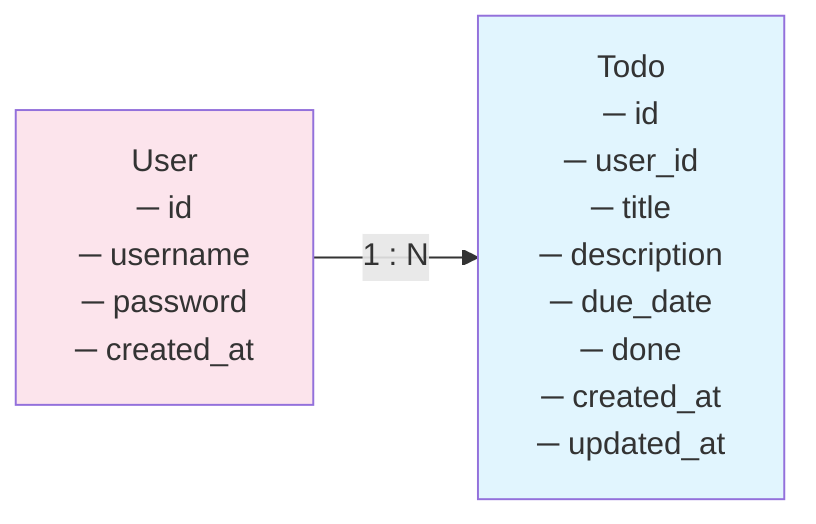

---

## 5. API 통신 구조

### 5.1 API 요청/응답 흐름

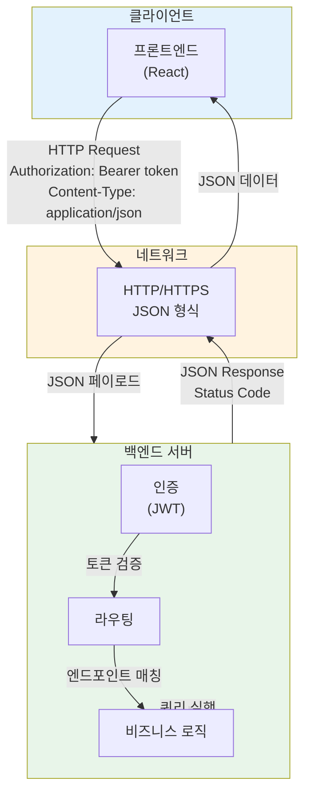

### 5.2 인증 흐름 (JWT)

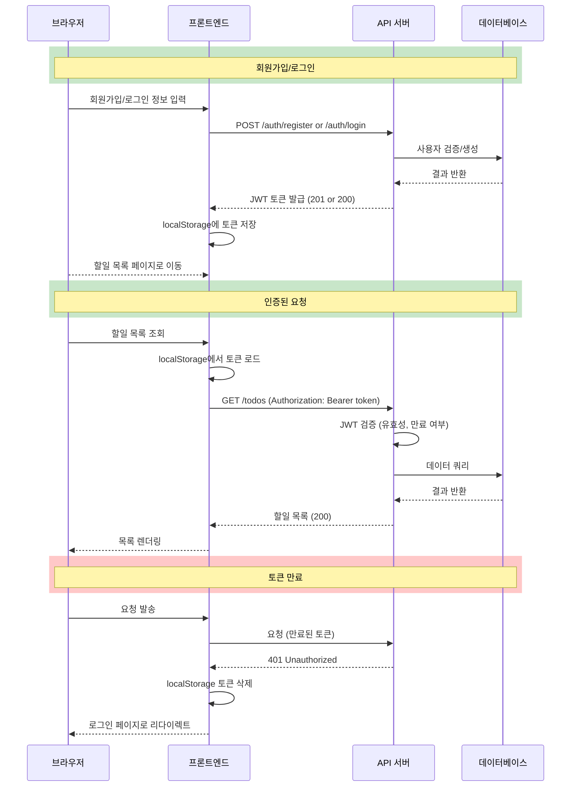

### 5.3 API 엔드포인트 맵

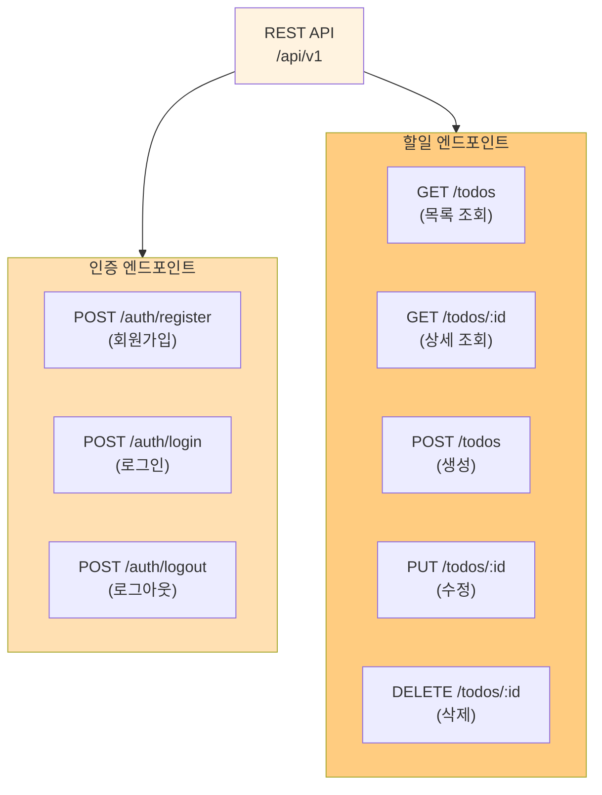

---

## 6. 배포 아키텍처

### 6.1 배포 환경 구성

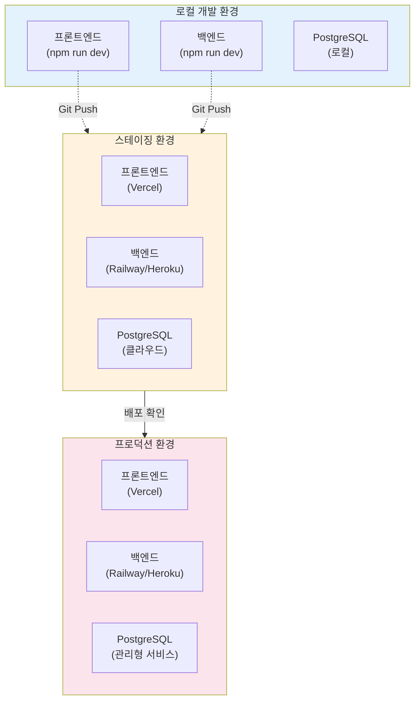

### 6.2 CI/CD 파이프라인

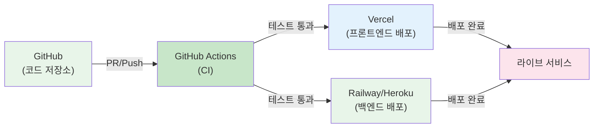

---

## 7. 보안 아키텍처

### 7.1 보안 계층

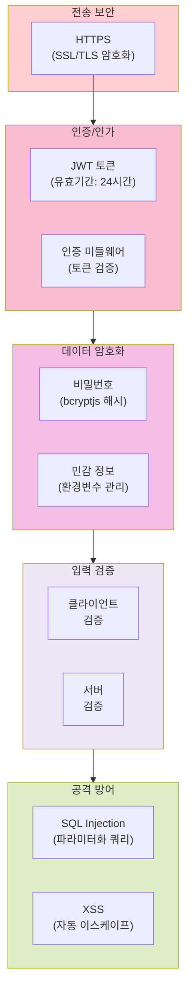

### 7.2 권한 검증 흐름

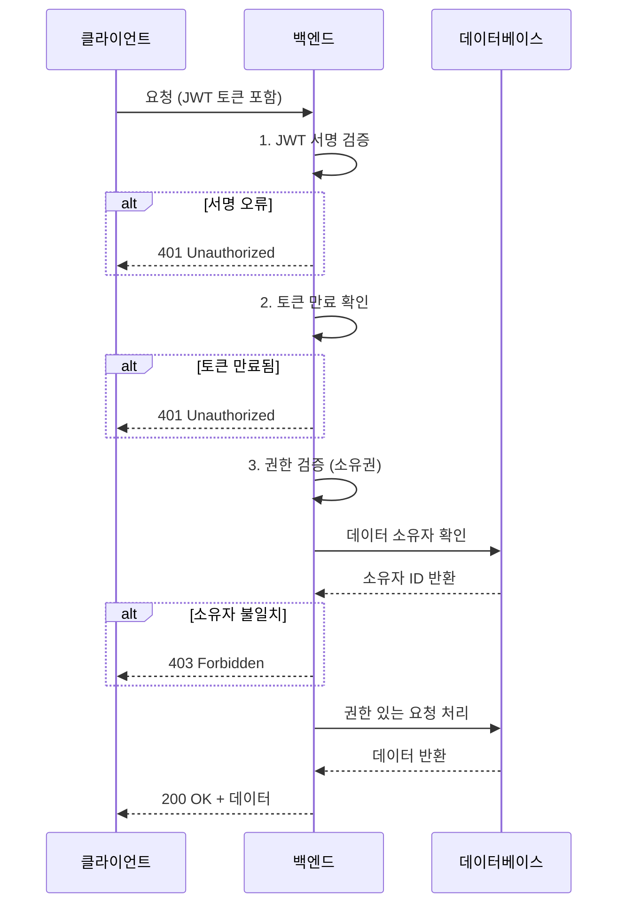

---

## 8. 성능 최적화 구조

### 8.1 성능 최적화 전략

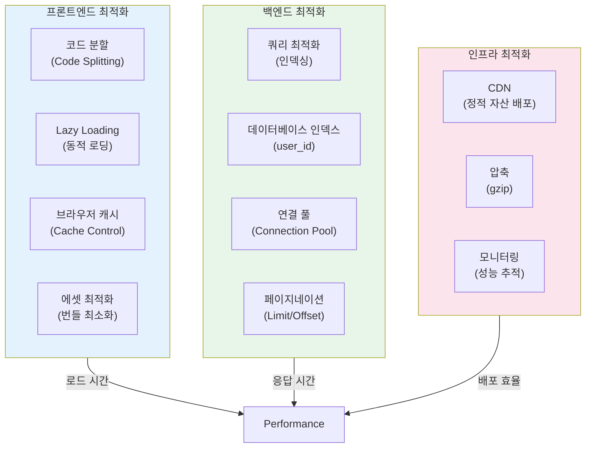

### 8.2 성능 목표

| 지표 | 목표 | 설명 |
|------|------|------|
| 초기 로드 시간 | < 2초 | 첫 페이지 렌더링 |
| API 응답 시간 | < 200ms | 평균 응답 시간 |
| 할일 목록 렌더링 | < 100ms | 50개 할일 기준 |
| TTI (Time to Interactive) | < 3초 | 사용자 상호작용 가능 시간 |

---

## 9. 시스템 상호작용 다이어그램

### 9.1 전체 데이터 흐름

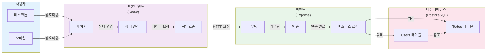

### 9.2 할일 생성 완전한 흐름

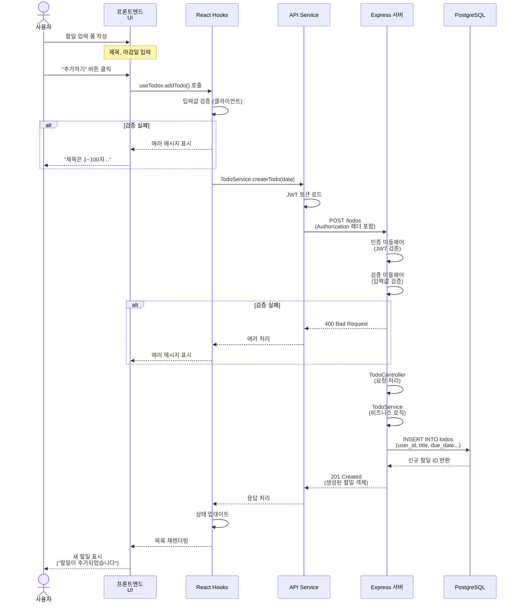

---

## 10. 아키텍처 핵심 특징

### 10.1 3계층 분리의 장점

| 계층 | 장점 | 특징 |
|------|------|------|
| **프론트엔드** | 사용자 경험 최적화 | 반응형 UI, 빠른 인터랙션 |
| **백엔드** | 비즈니스 로직 집중 | 데이터 검증, 보안, 성능 |
| **데이터베이스** | 데이터 무결성 | ACID 특성, 일관성 보장 |

### 10.2 기술 스택 선택 근거

| 기술 | 선택 이유 | 대안 |
|------|----------|------|
| **React** | 컴포넌트 기반 UI, 큰 커뮤니티 | Vue, Angular |
| **Express** | 가볍고 유연함, Node.js 표준 | Fastify, Nest.js |
| **PostgreSQL** | 관계형 데이터, 강력함 | MySQL, MongoDB |
| **JWT** | 상태 비저장, 확장성 | 세션, OAuth |

### 10.3 확장성 고려사항

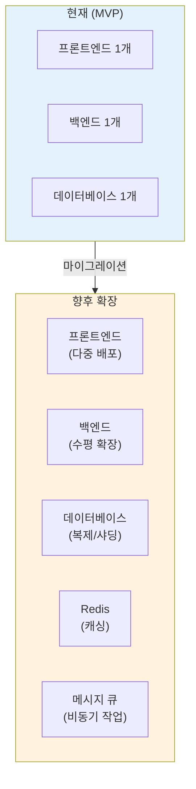

---

## 11. 배포 및 운영 체계

### 11.1 버전 관리 및 배포 프로세스

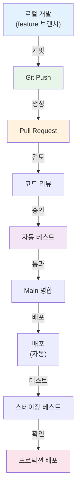

### 11.2 환경별 설정

| 환경 | 데이터베이스 | API 엔드포인트 | 로깅 | HTTPS |
|------|-------------|---------------|------|-------|
| **로컬** | localhost | http://localhost:3000 | 콘솔 | 불필요 |
| **스테이징** | 클라우드 DB | https://api-staging.xxx | 파일 | 필수 |
| **프로덕션** | 관리형 DB | https://api.xxx | 서비스 | 필수 |

---

## 12. 아키텍처 결론

### 12.1 주요 설계 원칙

1. **단순성**: KISS 원칙으로 유지보수 용이
2. **확장성**: 향후 기능 추가 가능한 모듈식 설계
3. **보안**: 모든 계층에 보안 조치 적용
4. **성능**: API 응답 < 200ms, 페이지 로드 < 2초 목표
5. **일관성**: 전체 코드베이스의 일관된 패턴

### 12.2 향후 개선 방향

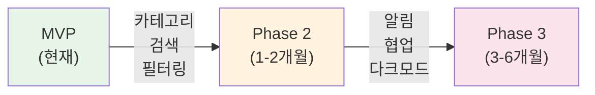

---

**문서 버전 이력**

| 버전 | 날짜 | 변경 내용 | 작성자 |
|------|------|----------|--------|
| 1.0 | 2026-02-11 | 초기 작성 (3계층 아키텍처, 상세 다이어그램 포함) | 기술 아키텍처팀 |

---

## 참고 문서

- **1-domain-definition.md** - 비즈니스 도메인 및 요구사항
- **2-PRD.md** - 제품 요구사항 및 기술 스택
- **3-user-scenario.md** - 사용자 시나리오 및 사용 패턴
- **4-project-principle.md** - 프로젝트 구조 설계 원칙
