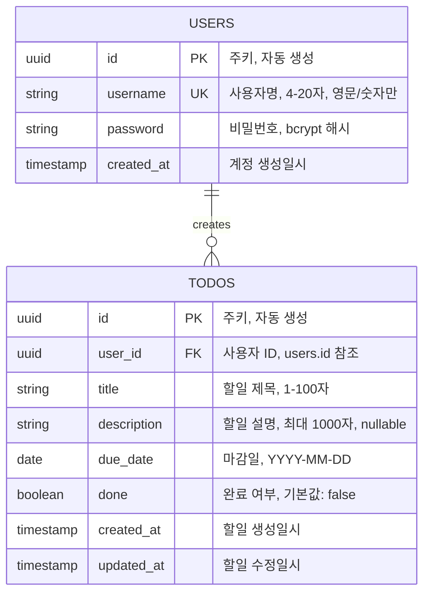

# ERD (Entity Relationship Diagram)

## 문서 정보

**버전**: 1.0
**작성일**: 2026-02-11
**최종 수정**: 2026-02-11
**작성자**: 문서 엔지니어
**상태**: MVP 데이터베이스 설계 완료

---

## 1. 개요

이 문서는 my-todolist 프로젝트의 PostgreSQL 기반 데이터베이스 설계를 정의합니다.
PRD(Product Requirements Document)의 요구사항을 기반으로 사용자 인증과 할일 관리를 위한
관계형 데이터모델을 제시합니다.

### 1.1 설계 원칙

- **정규화**: 제3정규형(3NF)을 준수하여 데이터 중복 최소화
- **확장성**: Phase 2 기능(카테고리, 라벨 등) 추가 시 용이한 구조
- **성능**: 자주 조회하는 필드에 인덱스 적용
- **무결성**: 외래키 제약으로 참조 무결성 보장
- **감시성**: 생성/수정 시간 기록으로 데이터 추적 가능

---

## 2. ERD 다이어그램

### 2.1 Mermaid ERD 형식



---

## 3. 엔티티 상세 설명

### 3.1 USERS 엔티티 (사용자)

사용자 계정 정보를 저장하는 테이블입니다.

#### 3.1.1 속성 정의

| 속성명 | 데이터타입 | 제약조건 | 기본값 | 설명 |
|--------|-----------|--------|--------|------|
| id | UUID | PK, NOT NULL | gen_random_uuid() | 사용자 고유 식별자 |
| username | VARCHAR(20) | UNIQUE, NOT NULL | - | 사용자명 (4~20자, 영문/숫자만) |
| password | VARCHAR(255) | NOT NULL | - | 비밀번호 (bcrypt 해시, 해시 길이 60자) |
| created_at | TIMESTAMP | NOT NULL | CURRENT_TIMESTAMP | 계정 생성 일시 |

#### 3.1.2 데이터 검증 규칙

- **username**
  - 길이: 4자 이상 20자 이하
  - 문자: 영문(A-Z, a-z)과 숫자(0-9)만 허용
  - 유니크: 중복 불가 (409 Conflict)
  - 트림: 좌우 공백 제거 후 검증

- **password**
  - 길이: 최소 8자 이상
  - 저장: bcryptjs로 해시화 (단방향 암호화)
  - 비교: bcrypt.compare() 사용
  - 평문 저장 금지

#### 3.1.3 주요 비즈니스 규칙

- BR-001: 회원가입 시 username은 중복될 수 없음 (UNIQUE 제약)
- BR-002: password는 bcrypt로 해시화되어 저장되며, 평문으로 저장되지 않음
- BR-010: 사용자 삭제 시 해당 사용자의 모든 할일이 자동 삭제됨 (ON DELETE CASCADE)

#### 3.1.4 인덱스

```sql
-- 자동 생성 (UNIQUE 제약으로 인한 인덱스)
CREATE UNIQUE INDEX idx_users_username ON users(username);

-- 성능 최적화
CREATE INDEX idx_users_created_at ON users(created_at);
```

#### 3.1.5 SQL 예시

```sql
-- 테이블 생성
CREATE TABLE users (
  id UUID PRIMARY KEY DEFAULT gen_random_uuid(),
  username VARCHAR(20) UNIQUE NOT NULL,
  password VARCHAR(255) NOT NULL,
  created_at TIMESTAMP NOT NULL DEFAULT CURRENT_TIMESTAMP
);

-- 샘플 데이터
INSERT INTO users (username, password) VALUES
('testuser', '$2b$10$...(bcrypt hash)...'),
('johndoe', '$2b$10$...(bcrypt hash)...');
```

---

### 3.2 TODOS 엔티티 (할일)

사용자의 할일 항목을 저장하는 테이블입니다.

#### 3.2.1 속성 정의

| 속성명 | 데이터타입 | 제약조건 | 기본값 | 설명 |
|--------|-----------|--------|--------|------|
| id | UUID | PK, NOT NULL | gen_random_uuid() | 할일 고유 식별자 |
| user_id | UUID | FK, NOT NULL | - | 사용자 ID (users.id 참조) |
| title | VARCHAR(100) | NOT NULL | - | 할일 제목 (1~100자) |
| description | VARCHAR(1000) | NULL | - | 할일 설명 (최대 1000자, 선택사항) |
| due_date | DATE | NOT NULL | - | 마감일 (YYYY-MM-DD 형식) |
| done | BOOLEAN | NOT NULL | FALSE | 완료 여부 |
| created_at | TIMESTAMP | NOT NULL | CURRENT_TIMESTAMP | 할일 생성 일시 |
| updated_at | TIMESTAMP | NOT NULL | CURRENT_TIMESTAMP | 할일 수정 일시 |

#### 3.2.2 데이터 검증 규칙

- **title**
  - 길이: 1자 이상 100자 이하
  - 필수: NOT NULL
  - 공백만 있는 경우 거부 (trim 후 검증)

- **description**
  - 길이: 최대 1000자
  - 선택사항: NULL 허용
  - 공백: 빈 문자열 또는 NULL 모두 허용

- **due_date**
  - 형식: YYYY-MM-DD (ISO 8601)
  - 필수: NOT NULL
  - 범위: 과거/미래 모두 가능 (유효한 날짜만)

- **done**
  - 타입: BOOLEAN (true/false)
  - 기본값: false
  - 토글: false → true 또는 true → false

#### 3.2.3 주요 비즈니스 규칙

- BR-003: 할일 생성, 조회, 수정, 삭제는 인증된 사용자만 가능
- BR-004: 사용자는 자신이 생성한 할일만 조회 및 수정할 수 있음
- BR-005: 할일 생성 시 user_id는 존재하는 사용자여야 함 (FK 제약)
- BR-006: isOverdue 계산: `(due_date < TODAY()) && (done = FALSE)`
  - 마감일 비교는 시간 제외, 날짜만 비교
  - 마감일이 오늘인 경우: isOverdue = false
  - 완료된 할일(done=true)은 isOverdue 무시
- BR-007: updatedAt은 수정 시마다 자동 갱신
- BR-008: 사용자 삭제 시 해당 사용자의 모든 할일 자동 삭제 (ON DELETE CASCADE)

#### 3.2.4 인덱스

```sql
-- 외래키 인덱스 (자동 생성)
CREATE INDEX idx_todos_user_id ON todos(user_id);

-- 성능 최적화 (자주 쿼리하는 필드)
CREATE INDEX idx_todos_due_date ON todos(due_date);
CREATE INDEX idx_todos_done ON todos(done);
CREATE INDEX idx_todos_user_id_due_date ON todos(user_id, due_date);
CREATE INDEX idx_todos_user_id_done ON todos(user_id, done);
CREATE INDEX idx_todos_created_at ON todos(created_at);
```

#### 3.2.5 SQL 예시

```sql
-- 테이블 생성
CREATE TABLE todos (
  id UUID PRIMARY KEY DEFAULT gen_random_uuid(),
  user_id UUID NOT NULL REFERENCES users(id) ON DELETE CASCADE,
  title VARCHAR(100) NOT NULL,
  description VARCHAR(1000),
  due_date DATE NOT NULL,
  done BOOLEAN NOT NULL DEFAULT FALSE,
  created_at TIMESTAMP NOT NULL DEFAULT CURRENT_TIMESTAMP,
  updated_at TIMESTAMP NOT NULL DEFAULT CURRENT_TIMESTAMP
);

-- 인덱스 생성
CREATE INDEX idx_todos_user_id ON todos(user_id);
CREATE INDEX idx_todos_due_date ON todos(due_date);
CREATE INDEX idx_todos_user_id_due_date ON todos(user_id, due_date);

-- 샘플 데이터
INSERT INTO todos (user_id, title, description, due_date, done) VALUES
('f47ac10b-58cc-4372-a567-0e02b2c3d479', '보고서 작성', '분기 실적', '2026-02-15', false),
('f47ac10b-58cc-4372-a567-0e02b2c3d479', '회의 준비', '', '2026-02-12', false);

-- 자동 갱신: updatedAt은 UPDATE 시 트리거로 처리
CREATE OR REPLACE FUNCTION update_todos_timestamp()
RETURNS TRIGGER AS $$
BEGIN
  NEW.updated_at = CURRENT_TIMESTAMP;
  RETURN NEW;
END;
$$ LANGUAGE plpgsql;

CREATE TRIGGER todos_update_timestamp
BEFORE UPDATE ON todos
FOR EACH ROW
EXECUTE FUNCTION update_todos_timestamp();
```

---

## 4. 엔티티 간 관계

### 4.1 관계 정의

#### 4.1.1 USERS → TODOS (1:N 관계)

- **카디널리티**: 1:N (일대다)
- **설명**: 한 사용자는 여러 개의 할일을 생성할 수 있음
- **구현**: todos.user_id (FK) → users.id (PK)
- **무결성**:
  - 참조 무결성: todos의 user_id는 항상 users에 존재하는 id를 참조
  - ON DELETE CASCADE: 사용자 삭제 시 해당 할일 자동 삭제
  - ON UPDATE CASCADE: 사용자 id 변경 시 할일의 user_id 자동 갱신

#### 4.1.2 관계도 (텍스트)

```
┌──────────────────┐         ┌──────────────────┐
│     USERS        │         │     TODOS        │
├──────────────────┤         ├──────────────────┤
│ id (PK)      │◄──┼─────────┤ user_id (FK)     │
│ username     │   │ 1:N     │ id (PK)          │
│ password     │   │         │ title            │
│ created_at   │   │         │ description      │
└──────────────────┘         │ due_date         │
                             │ done             │
                             │ created_at       │
                             │ updated_at       │
                             └──────────────────┘
```

### 4.2 관계의 영향

#### 사용자 생성 → 할일 생성 흐름

```
1. 사용자 가입
   → INSERT INTO users (username, password) VALUES (...)
   → users.id (UUID) 자동 생성

2. 할일 추가
   → INSERT INTO todos (user_id, title, ...) VALUES (...)
   → todos.user_id는 users.id를 참조 (FK 검증)

3. 할일 조회
   → SELECT * FROM todos WHERE user_id = ? ORDER BY due_date
   → 사용자별 할일만 조회 (소유권 검증)

4. 사용자 삭제
   → DELETE FROM users WHERE id = ?
   → CASCADE: 해당 사용자의 모든 할일 자동 삭제
```

---

## 5. 데이터 흐름 및 라이프사이클

### 5.1 사용자 라이프사이클

```
[회원가입]
   ↓
INSERT INTO users (username, password)
   ↓
users 테이블에 신규 레코드 생성
   ↓
[로그인]
   ↓
SELECT * FROM users WHERE username = ?
   ↓
bcrypt.compare(password_input, users.password)
   ↓
[로그아웃/탈퇴]
   ↓
DELETE FROM users WHERE id = ? (ON DELETE CASCADE 실행)
   ↓
users 테이블에서 레코드 삭제
할일 테이블에서 해당 사용자의 모든 할일도 자동 삭제
```

### 5.2 할일 라이프사이클

```
[할일 추가]
   ↓
POST /todos
   ↓
INSERT INTO todos (user_id, title, description, due_date, done)
   ↓
todos 테이블에 신규 레코드 생성 (uuid id 자동 생성)
   ↓
[할일 조회]
   ↓
GET /todos (user_id 필터링)
   ↓
SELECT * FROM todos WHERE user_id = ? ORDER BY due_date
   ↓
isOverdue 계산: (due_date < TODAY()) && (done = FALSE)
   ↓
[할일 수정]
   ↓
PUT /todos/:id
   ↓
UPDATE todos SET title = ?, description = ?, due_date = ?, done = ?
   ↓
updated_at 자동 갱신 (트리거)
   ↓
[할일 삭제]
   ↓
DELETE /todos/:id
   ↓
todos 테이블에서 레코드 삭제
```

---

## 6. 성능 최적화 전략

### 6.1 인덱스 전략

#### 필수 인덱스

```sql
-- 1. 사용자 인증 성능 향상
CREATE UNIQUE INDEX idx_users_username ON users(username);

-- 2. 사용자별 할일 조회 성능 향상
CREATE INDEX idx_todos_user_id ON todos(user_id);

-- 3. 마감일순 정렬 성능 향상
CREATE INDEX idx_todos_user_id_due_date ON todos(user_id, due_date);

-- 4. done 상태 필터링
CREATE INDEX idx_todos_user_id_done ON todos(user_id, done);

-- 5. 완료되지 않은 지연 항목 조회
CREATE INDEX idx_todos_overdue ON todos(user_id, done, due_date);
```

#### 복합 인덱스 (Composite Index)

```sql
-- 자주 함께 사용되는 필드를 인덱스에 포함
-- WHERE user_id = ? ORDER BY due_date를 효율적으로 처리
CREATE INDEX idx_todos_user_id_due_date ON todos(user_id, due_date);

-- WHERE user_id = ? AND done = FALSE를 효율적으로 처리
CREATE INDEX idx_todos_user_id_done ON todos(user_id, done);
```

### 6.2 쿼리 최적화

#### MVP 필수 쿼리

```sql
-- 1. 사용자별 할일 조회 (마감일순)
SELECT * FROM todos
WHERE user_id = $1
ORDER BY due_date ASC;

-- 2. 사용자별 완료되지 않은 할일 (마감일순)
SELECT * FROM todos
WHERE user_id = $1 AND done = FALSE
ORDER BY due_date ASC;

-- 3. 사용자별 지연 할일 조회
SELECT * FROM todos
WHERE user_id = $1 AND done = FALSE AND due_date < CURRENT_DATE
ORDER BY due_date ASC;

-- 4. 할일 상세 조회 (소유권 검증)
SELECT * FROM todos
WHERE id = $1 AND user_id = $2;

-- 5. 사용자 인증
SELECT id, password FROM users
WHERE username = $1;
```

#### Phase 2 예상 쿼리

```sql
-- 카테고리별 할일
SELECT * FROM todos
WHERE user_id = $1 AND category_id = $2
ORDER BY due_date;

-- 라벨로 검색
SELECT * FROM todos t
INNER JOIN todo_labels tl ON t.id = tl.todo_id
WHERE t.user_id = $1 AND tl.label_id = $2
ORDER BY t.due_date;

-- 반복 할일 조회
SELECT * FROM todos
WHERE user_id = $1 AND recurrence_type IS NOT NULL
ORDER BY due_date;
```

### 6.3 캐싱 전략

#### 향후 계획 (Phase 2+)

```
클라이언트 캐싱:
- JWT 토큰: localStorage (24시간)
- 사용자 프로필: localStorage (만료 시까지)
- 할일 목록: 메모리 캐시 (5분 TTL)

서버 캐싱:
- Redis: 자주 조회하는 할일 목록 (5분 TTL)
- 데이터베이스: 기본 저장소

캐시 무효화:
- 할일 생성/수정/삭제 시 캐시 제거
- 사용자 로그아웃 시 세션 캐시 제거
```

---

## 7. 데이터 무결성 및 제약사항

### 7.1 NOT NULL 제약

| 테이블 | 필드 | 이유 |
|--------|------|------|
| users | id, username, password, created_at | 필수 정보 |
| todos | id, user_id, title, due_date, done, created_at, updated_at | 필수 정보 |

### 7.2 UNIQUE 제약

| 테이블 | 필드 | 이유 |
|--------|------|------|
| users | username | 각 사용자는 고유한 username을 가져야 함 |
| users | id | PK이므로 자동으로 유니크 |
| todos | id | PK이므로 자동으로 유니크 |

### 7.3 FOREIGN KEY 제약

| 참조 테이블 | 참조 필드 | 피참조 테이블 | 피참조 필드 | 삭제 정책 |
|-----------|---------|-----------|---------|---------|
| todos | user_id | users | id | ON DELETE CASCADE |

### 7.4 DEFAULT 값

| 테이블 | 필드 | 기본값 | 설명 |
|--------|------|--------|------|
| users | id | gen_random_uuid() | 자동 UUID 생성 |
| users | created_at | CURRENT_TIMESTAMP | 생성 시간 자동 기록 |
| todos | id | gen_random_uuid() | 자동 UUID 생성 |
| todos | done | FALSE | 신규 할일은 미완료 상태 |
| todos | created_at | CURRENT_TIMESTAMP | 생성 시간 자동 기록 |
| todos | updated_at | CURRENT_TIMESTAMP | 수정 시간 자동 기록 |

---

## 8. 마이그레이션 및 초기화

### 8.1 데이터베이스 초기화 SQL

```sql
-- 순서: 1. 기존 테이블 제거 (개발 환경 전용)
DROP TABLE IF EXISTS todos CASCADE;
DROP TABLE IF EXISTS users CASCADE;

-- 2. users 테이블 생성
CREATE TABLE users (
  id UUID PRIMARY KEY DEFAULT gen_random_uuid(),
  username VARCHAR(20) UNIQUE NOT NULL,
  password VARCHAR(255) NOT NULL,
  created_at TIMESTAMP NOT NULL DEFAULT CURRENT_TIMESTAMP
);

-- 3. todos 테이블 생성
CREATE TABLE todos (
  id UUID PRIMARY KEY DEFAULT gen_random_uuid(),
  user_id UUID NOT NULL REFERENCES users(id) ON DELETE CASCADE,
  title VARCHAR(100) NOT NULL,
  description VARCHAR(1000),
  due_date DATE NOT NULL,
  done BOOLEAN NOT NULL DEFAULT FALSE,
  created_at TIMESTAMP NOT NULL DEFAULT CURRENT_TIMESTAMP,
  updated_at TIMESTAMP NOT NULL DEFAULT CURRENT_TIMESTAMP
);

-- 4. 인덱스 생성
CREATE UNIQUE INDEX idx_users_username ON users(username);
CREATE INDEX idx_todos_user_id ON todos(user_id);
CREATE INDEX idx_todos_due_date ON todos(due_date);
CREATE INDEX idx_todos_done ON todos(done);
CREATE INDEX idx_todos_user_id_due_date ON todos(user_id, due_date);
CREATE INDEX idx_todos_user_id_done ON todos(user_id, done);

-- 5. 트리거 생성 (updated_at 자동 갱신)
CREATE OR REPLACE FUNCTION update_todos_timestamp()
RETURNS TRIGGER AS $$
BEGIN
  NEW.updated_at = CURRENT_TIMESTAMP;
  RETURN NEW;
END;
$$ LANGUAGE plpgsql;

CREATE TRIGGER todos_update_timestamp
BEFORE UPDATE ON todos
FOR EACH ROW
EXECUTE FUNCTION update_todos_timestamp();

-- 6. 샘플 데이터 (선택사항)
INSERT INTO users (username, password) VALUES
('gdhong', '$2b$10$...(bcrypt hash)...'),
('mrlee', '$2b$10$...(bcrypt hash)...');

-- 7. 타임존 설정 (권장)
ALTER DATABASE my_todolist SET timezone = 'UTC';
```

### 8.2 Node.js/Express에서 초기화

```javascript
// src/config/database.js
const { Pool } = require('pg');

const pool = new Pool({
  connectionString: process.env.DATABASE_URL,
});

// 초기화 함수
async function initializeDatabase() {
  const client = await pool.connect();
  try {
    // users 테이블
    await client.query(`
      CREATE TABLE IF NOT EXISTS users (
        id UUID PRIMARY KEY DEFAULT gen_random_uuid(),
        username VARCHAR(20) UNIQUE NOT NULL,
        password VARCHAR(255) NOT NULL,
        created_at TIMESTAMP NOT NULL DEFAULT CURRENT_TIMESTAMP
      );
    `);

    // todos 테이블
    await client.query(`
      CREATE TABLE IF NOT EXISTS todos (
        id UUID PRIMARY KEY DEFAULT gen_random_uuid(),
        user_id UUID NOT NULL REFERENCES users(id) ON DELETE CASCADE,
        title VARCHAR(100) NOT NULL,
        description VARCHAR(1000),
        due_date DATE NOT NULL,
        done BOOLEAN NOT NULL DEFAULT FALSE,
        created_at TIMESTAMP NOT NULL DEFAULT CURRENT_TIMESTAMP,
        updated_at TIMESTAMP NOT NULL DEFAULT CURRENT_TIMESTAMP
      );
    `);

    // 인덱스
    await client.query(`
      CREATE UNIQUE INDEX IF NOT EXISTS idx_users_username ON users(username);
    `);
    await client.query(`
      CREATE INDEX IF NOT EXISTS idx_todos_user_id ON todos(user_id);
    `);
    await client.query(`
      CREATE INDEX IF NOT EXISTS idx_todos_user_id_due_date ON todos(user_id, due_date);
    `);

    console.log('Database initialized successfully');
  } catch (error) {
    console.error('Database initialization error:', error);
  } finally {
    client.release();
  }
}

module.exports = { pool, initializeDatabase };
```

---

## 9. Phase 2 이후 확장 계획

### 9.1 예상 추가 엔티티

#### CATEGORIES (할일 카테고리)

```
CREATE TABLE categories (
  id UUID PRIMARY KEY DEFAULT gen_random_uuid(),
  user_id UUID NOT NULL REFERENCES users(id) ON DELETE CASCADE,
  name VARCHAR(50) NOT NULL,
  color VARCHAR(7), -- #RRGGBB
  created_at TIMESTAMP DEFAULT CURRENT_TIMESTAMP,
  UNIQUE(user_id, name)
);

ALTER TABLE todos ADD COLUMN category_id UUID REFERENCES categories(id) ON DELETE SET NULL;
```

#### LABELS (할일 라벨)

```
CREATE TABLE labels (
  id UUID PRIMARY KEY DEFAULT gen_random_uuid(),
  user_id UUID NOT NULL REFERENCES users(id) ON DELETE CASCADE,
  name VARCHAR(30) NOT NULL,
  created_at TIMESTAMP DEFAULT CURRENT_TIMESTAMP,
  UNIQUE(user_id, name)
);

CREATE TABLE todo_labels (
  todo_id UUID NOT NULL REFERENCES todos(id) ON DELETE CASCADE,
  label_id UUID NOT NULL REFERENCES labels(id) ON DELETE CASCADE,
  PRIMARY KEY (todo_id, label_id)
);
```

#### RECURRING_TODOS (반복 할일)

```
CREATE TABLE recurring_todos (
  id UUID PRIMARY KEY DEFAULT gen_random_uuid(),
  user_id UUID NOT NULL REFERENCES users(id) ON DELETE CASCADE,
  title VARCHAR(100) NOT NULL,
  description VARCHAR(1000),
  recurrence_type VARCHAR(20), -- 'daily', 'weekly', 'monthly'
  recurrence_end_date DATE,
  created_at TIMESTAMP DEFAULT CURRENT_TIMESTAMP
);

ALTER TABLE todos ADD COLUMN recurring_todo_id UUID REFERENCES recurring_todos(id) ON DELETE SET NULL;
```

#### REMINDERS (알림)

```
CREATE TABLE reminders (
  id UUID PRIMARY KEY DEFAULT gen_random_uuid(),
  user_id UUID NOT NULL REFERENCES users(id) ON DELETE CASCADE,
  todo_id UUID NOT NULL REFERENCES todos(id) ON DELETE CASCADE,
  reminder_time TIMESTAMP NOT NULL,
  notification_type VARCHAR(20), -- 'email', 'push', 'in_app'
  sent BOOLEAN DEFAULT FALSE,
  created_at TIMESTAMP DEFAULT CURRENT_TIMESTAMP
);

CREATE INDEX idx_reminders_user_id ON reminders(user_id);
CREATE INDEX idx_reminders_sent_reminder_time ON reminders(sent, reminder_time);
```

### 9.2 확장 후 ERD

```
USERS (1) --o{ (N) TODOS
USERS (1) --o{ (N) CATEGORIES
USERS (1) --o{ (N) LABELS
USERS (1) --o{ (N) RECURRING_TODOS
USERS (1) --o{ (N) REMINDERS
CATEGORIES (1) --o{ (N) TODOS
LABELS (N) --o{ (N) TODOS (through LABELS)
RECURRING_TODOS (1) --o{ (N) TODOS
TODOS (1) --o{ (N) REMINDERS
```

---

## 10. 보안 고려사항

### 10.1 데이터베이스 보안

#### SQL Injection 방지

```javascript
// ✅ 안전: 파라미터화된 쿼리
const result = await pool.query(
  'SELECT * FROM users WHERE username = $1',
  [username]
);

// ❌ 위험: 문자열 연결
const result = await pool.query(`SELECT * FROM users WHERE username = '${username}'`);
```

#### 비밀번호 보안

```javascript
// ✅ 올바른 방식
const bcrypt = require('bcryptjs');
const hashedPassword = await bcrypt.hash(password, 10);
// 저장: hashedPassword (60자)

// ❌ 위험한 방식
// 평문 저장
// 단순 MD5/SHA 해시 (단방향 암호화 미지원)
```

### 10.2 접근 제어

- **BR-003**: JWT 인증 미들웨어로 모든 할일 엔드포인트 보호
- **BR-004**: 소유권 검증으로 타인 할일 접근 방지
  ```sql
  -- 할일 수정 시 검증
  SELECT * FROM todos WHERE id = $1 AND user_id = $2;
  -- user_id 불일치 시 404 또는 403 반환
  ```

### 10.3 데이터 프라이버시

- **개인 데이터**: username, password, 할일 내용
- **규정**: GDPR/개인정보보호법 준수
- **백업**: 일일 자동 백업 (암호화 저장)
- **삭제**: 사용자 삭제 시 모든 데이터 자동 삭제 (CASCADE)

---

## 11. 모니터링 및 유지보수

### 11.1 성능 모니터링

```sql
-- 슬로우 쿼리 로깅
ALTER SYSTEM SET log_min_duration_statement = 1000; -- 1초 이상
SELECT pg_reload_conf();

-- 인덱스 사용 현황
SELECT schemaname, tablename, indexname, idx_scan, idx_tup_read, idx_tup_fetch
FROM pg_stat_user_indexes
ORDER BY idx_scan DESC;

-- 테이블 크기
SELECT schemaname, tablename, pg_size_pretty(pg_total_relation_size(schemaname||'.'||tablename)) AS size
FROM pg_tables
WHERE schemaname = 'public'
ORDER BY pg_total_relation_size(schemaname||'.'||tablename) DESC;
```

### 11.2 데이터 품질 관리

```sql
-- 고아 레코드 확인 (users에 없는 user_id 참조)
SELECT t.id, t.user_id
FROM todos t
LEFT JOIN users u ON t.user_id = u.id
WHERE u.id IS NULL;

-- 중복 username 확인
SELECT username, COUNT(*)
FROM users
GROUP BY username
HAVING COUNT(*) > 1;

-- 미완료 지연 할일 통계
SELECT COUNT(*) as overdue_count
FROM todos
WHERE done = FALSE AND due_date < CURRENT_DATE;
```

### 11.3 정기 유지보수

| 작업 | 빈도 | 설명 |
|------|------|------|
| VACUUM | 주 1회 | 데드 튜플 정리 |
| ANALYZE | 주 1회 | 통계 정보 갱신 |
| 인덱스 재구성 | 월 1회 | 인덱스 조각화 해소 |
| 백업 | 일 1회 | 데이터 복구 대비 |
| 로그 정리 | 월 1회 | 저장소 효율화 |

---

## 12. 문제 해결 가이드

### 12.1 일반적인 데이터베이스 이슈

#### 이슈: username 중복 에러

```
에러: duplicate key value violates unique constraint "idx_users_username"
원인: 이미 존재하는 username으로 회원가입 시도
해결:
1. 다른 username으로 재시도
2. 기존 username 찾기: SELECT * FROM users WHERE username = ?
3. 소프트 삭제 고려 (Phase 2+)
```

#### 이슈: 할일이 삭제되지 않음

```
에러: 특정 할일 DELETE 요청 후 데이터 유지
원인: 소유권 검증 미흡 또는 트랜잭션 롤백
해결:
1. 소유권 확인: SELECT * FROM todos WHERE id = ? AND user_id = ?
2. 데이터베이스 연결 확인
3. 트랜잭션 로그 확인: SELECT * FROM todos WHERE id = ?
```

#### 이슈: 쿼리 성능 저하

```
원인: 인덱스 누락 또는 부적절한 쿼리
해결:
1. 슬로우 쿼리 로그 확인
2. EXPLAIN ANALYZE로 실행 계획 분석
3. 복합 인덱스 추가 (예: idx_todos_user_id_due_date)
4. 쿼리 최적화 (불필요한 전체 컬럼 조회 제거)
```

---

## 13. 참고 자료

### 13.1 관련 문서

- **도메인 정의서**: `docs/1-domain-definition.md`
- **PRD**: `docs/2-PRD.md`
- **API 명세서**: `docs/3-api-specification.md`
- **아키텍처 다이어그램**: `docs/5-arch-diagram.md`

### 13.2 PostgreSQL 공식 문서

- [UUID Type](https://www.postgresql.org/docs/current/datatype-uuid.html)
- [Date/Time Types](https://www.postgresql.org/docs/current/datatype-datetime.html)
- [Foreign Keys](https://www.postgresql.org/docs/current/ddl-constraints.html#DDL-CONSTRAINTS-FK)
- [Indexes](https://www.postgresql.org/docs/current/sql-createindex.html)
- [Triggers](https://www.postgresql.org/docs/current/sql-createtrigger.html)

### 13.3 관련 라이브러리

- **pg**: [npm pg](https://www.npmjs.com/package/pg)
- **bcryptjs**: [npm bcryptjs](https://www.npmjs.com/package/bcryptjs)
- **uuid**: [npm uuid](https://www.npmjs.com/package/uuid)

---

## 14. 변경 이력

| 버전 | 날짜 | 변경 내용 | 작성자 |
|------|------|----------|--------|
| 1.0 | 2026-02-11 | MVP ERD 최초 작성, USERS/TODOS 엔티티 정의, 관계 및 제약사항 포함 | 문서 엔지니어 |

---

**문서 완료 일시**: 2026-02-11 16:30 KST
**다음 검토 예정**: 2026-02-12 (개발팀 피드백 반영)
