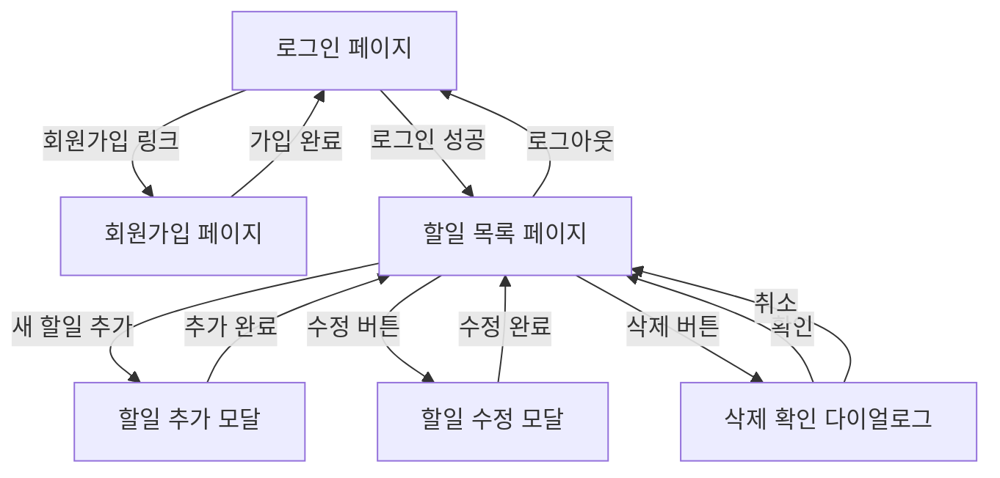

# 와이어프레임
## my-todolist 프로젝트

---

**버전**: 1.0
**작성일**: 2026-02-11
**작성자**: UI 디자인팀
**상태**: MVP 개발 진행 중

---

## 1. 전체 화면 플로우



### 1.1 화면 전환 시나리오

| 시작 화면 | 액션 | 목표 화면 | 전환 방식 |
|----------|------|----------|---------|
| 로그인 페이지 | "회원가입" 링크 클릭 | 회원가입 페이지 | 페이지 이동 |
| 회원가입 페이지 | 가입 완료 | 로그인 페이지 | 자동 리다이렉트 |
| 로그인 페이지 | 로그인 성공 | 할일 목록 페이지 | 페이지 이동 |
| 할일 목록 | "새 할일 추가" 클릭 | 할일 추가 모달 | 모달 오버레이 |
| 할일 목록 | "수정" 버튼 클릭 | 할일 수정 모달 | 모달 오버레이 |
| 할일 목록 | "삭제" 버튼 클릭 | 삭제 확인 다이얼로그 | 확인 대화상자 |
| 할일 목록 | "로그아웃" 클릭 | 로그인 페이지 | 페이지 이동 |

---

## 2. 화면별 와이어프레임

### 2.1 로그인 페이지

#### 2.1.1 데스크톱 레이아웃 (≥ 992px)

```
┌───────────────────────────────────────────────────────────────┐
│                                                               │
│                         [로고 이미지]                         │
│                        my-todolist                            │
│                                                               │
│              ┌─────────────────────────────┐                 │
│              │                             │                 │
│              │         로그인              │                 │
│              │                             │                 │
│              │  ┌───────────────────────┐ │                 │
│              │  │ 아이디                │ │                 │
│              │  │ [___________________] │ │                 │
│              │  └───────────────────────┘ │                 │
│              │                             │                 │
│              │  ┌───────────────────────┐ │                 │
│              │  │ 비밀번호              │ │                 │
│              │  │ [___________________] │ │                 │
│              │  └───────────────────────┘ │                 │
│              │                             │                 │
│              │  ┌───────────────────────┐ │                 │
│              │  │   [  로그인 하기  ]   │ │                 │
│              │  └───────────────────────┘ │                 │
│              │                             │                 │
│              │  계정이 없으신가요?         │                 │
│              │  [회원가입]                 │                 │
│              │                             │                 │
│              └─────────────────────────────┘                 │
│                                                               │
└───────────────────────────────────────────────────────────────┘
```

#### 2.1.2 모바일 레이아웃 (< 576px)

```
┌─────────────────────────┐
│                         │
│     [로고]              │
│   my-todolist           │
│                         │
│  ┌───────────────────┐  │
│  │     로그인        │  │
│  │                   │  │
│  │ 아이디            │  │
│  │ [_______________] │  │
│  │                   │  │
│  │ 비밀번호          │  │
│  │ [_______________] │  │
│  │                   │  │
│  │ [  로그인 하기  ] │  │
│  │                   │  │
│  │ 계정이 없으신가요?│  │
│  │ [회원가입]        │  │
│  └───────────────────┘  │
│                         │
└─────────────────────────┘
```

#### 2.1.3 UI 요소 상세

| 요소 | 타입 | 크기 | 스타일 | 인터랙션 |
|------|------|------|--------|---------|
| 로고 | 이미지/텍스트 | 60px 높이 | 브랜드 컬러 | - |
| 로그인 컨테이너 | 박스 | 최대 400px 너비 | 흰색 배경, 그림자 | - |
| 아이디 입력 필드 | Input text | 100% 너비, 44px 높이 | 회색 테두리 | focus 시 파란색 테두리 |
| 비밀번호 입력 필드 | Input password | 100% 너비, 44px 높이 | 회색 테두리 | focus 시 파란색 테두리 |
| 로그인 버튼 | Button | 100% 너비, 48px 높이 | 파란색 배경, 흰색 텍스트 | hover 시 어두운 파란색 |
| 회원가입 링크 | Link | 인라인 | 파란색 텍스트, 밑줄 | hover 시 진한 파란색 |

#### 2.1.4 상태별 UI 변화

**입력 필드 상태**
- 기본: 회색 테두리 (#ddd)
- Focus: 파란색 테두리 (#007bff)
- Error: 빨간색 테두리 (#dc3545)
- Disabled: 회색 배경 (#f5f5f5)

**로그인 버튼 상태**
- 기본: 파란색 배경 (#007bff)
- Hover: 어두운 파란색 (#0056b3)
- Active: 더 어두운 파란색 (#004085)
- Loading: 스피너 표시 + 비활성화

**에러 메시지 표시**
```
┌─────────────────────────────┐
│ 아이디                      │
│ [_________________________] │
│                             │
│ ⚠️ 아이디 또는 비밀번호가   │
│    일치하지 않습니다.       │
└─────────────────────────────┘
```

---

### 2.2 회원가입 페이지

#### 2.2.1 데스크톱 레이아웃 (≥ 992px)

```
┌───────────────────────────────────────────────────────────────┐
│                                                               │
│                         [로고 이미지]                         │
│                        my-todolist                            │
│                                                               │
│              ┌─────────────────────────────┐                 │
│              │                             │                 │
│              │        회원가입             │                 │
│              │                             │                 │
│              │  ┌───────────────────────┐ │                 │
│              │  │ 아이디                │ │                 │
│              │  │ [___________________] │ │                 │
│              │  │ 4~20자, 영문/숫자만   │ │                 │
│              │  └───────────────────────┘ │                 │
│              │                             │                 │
│              │  ┌───────────────────────┐ │                 │
│              │  │ 비밀번호              │ │                 │
│              │  │ [___________________] │ │                 │
│              │  │ 8자 이상              │ │                 │
│              │  └───────────────────────┘ │                 │
│              │                             │                 │
│              │  ┌───────────────────────┐ │                 │
│              │  │ 비밀번호 확인         │ │                 │
│              │  │ [___________________] │ │                 │
│              │  └───────────────────────┘ │                 │
│              │                             │                 │
│              │  ┌───────────────────────┐ │                 │
│              │  │   [  가입하기  ]      │ │                 │
│              │  └───────────────────────┘ │                 │
│              │                             │                 │
│              │  이미 계정이 있으신가요?    │                 │
│              │  [로그인]                   │                 │
│              │                             │                 │
│              └─────────────────────────────┘                 │
│                                                               │
└───────────────────────────────────────────────────────────────┘
```

#### 2.2.2 모바일 레이아웃 (< 576px)

```
┌─────────────────────────┐
│                         │
│     [로고]              │
│   my-todolist           │
│                         │
│  ┌───────────────────┐  │
│  │    회원가입       │  │
│  │                   │  │
│  │ 아이디            │  │
│  │ [_______________] │  │
│  │ 4~20자, 영문/숫자 │  │
│  │                   │  │
│  │ 비밀번호          │  │
│  │ [_______________] │  │
│  │ 8자 이상          │  │
│  │                   │  │
│  │ 비밀번호 확인     │  │
│  │ [_______________] │  │
│  │                   │  │
│  │ [  가입하기  ]    │  │
│  │                   │  │
│  │ 이미 계정이 있나요?│  │
│  │ [로그인]          │  │
│  └───────────────────┘  │
│                         │
└─────────────────────────┘
```

#### 2.2.3 UI 요소 상세

| 요소 | 타입 | 크기 | 스타일 | 인터랙션 |
|------|------|------|--------|---------|
| 아이디 입력 필드 | Input text | 100% 너비, 44px 높이 | 회색 테두리 | 실시간 유효성 검사 |
| 아이디 힌트 텍스트 | Text | 12px | 회색 (#666) | - |
| 비밀번호 입력 필드 | Input password | 100% 너비, 44px 높이 | 회색 테두리 | 실시간 유효성 검사 |
| 비밀번호 힌트 텍스트 | Text | 12px | 회색 (#666) | - |
| 비밀번호 확인 필드 | Input password | 100% 너비, 44px 높이 | 회색 테두리 | 일치 여부 확인 |
| 가입하기 버튼 | Button | 100% 너비, 48px 높이 | 파란색 배경 | hover 시 어두운 파란색 |

#### 2.2.4 유효성 검사 표시

**성공 상태**
```
┌───────────────────────────┐
│ 아이디                    │
│ [testuser_____________]   │
│ ✓ 사용 가능한 아이디입니다│
└───────────────────────────┘
```

**실패 상태**
```
┌───────────────────────────┐
│ 아이디                    │
│ [ab____________________]  │
│ ⚠️ 아이디는 4~20자의      │
│    영문과 숫자로 입력해주세요│
└───────────────────────────┘
```

**중복 아이디**
```
┌───────────────────────────┐
│ 아이디                    │
│ [testuser_____________]   │
│ ⚠️ 이미 사용 중인 아이디입니다│
└───────────────────────────┘
```

---

### 2.3 할일 목록 페이지 (메인)

#### 2.3.1 데스크톱 레이아웃 (≥ 992px)

```
┌───────────────────────────────────────────────────────────────────────┐
│  ┌─────────────────────────────────────────────────────────────────┐ │
│  │  [로고] my-todolist              [안녕하세요, kim_jikwon님] [로그아웃]│
│  └─────────────────────────────────────────────────────────────────┘ │
├───────────────────────────────────────────────────────────────────────┤
│                                                                       │
│  ┌─────────────────────────────────────────────────────────────────┐ │
│  │                                                                   │ │
│  │  할일 목록                              [+ 새 할일 추가]          │ │
│  │                                                                   │ │
│  │  ┌─────────────────────────────────────────────────────────────┐ │ │
│  │  │ [☑] 프로젝트 기획서 작성                         [수정] [삭제]│ │ │
│  │  │     마감일: 2026-02-15                                        │ │ │
│  │  │     분기 실적 보고서 작성 필요                                │ │ │
│  │  └─────────────────────────────────────────────────────────────┘ │ │
│  │                                                                   │ │
│  │  ┌─────────────────────────────────────────────────────────────┐ │ │
│  │  │ [ ] 보고서 작성  ⚠️                              [수정] [삭제]│ │ │
│  │  │     마감일: 2026-02-10 (지연)                                 │ │ │
│  │  │     긴급 처리 필요                                            │ │ │
│  │  └─────────────────────────────────────────────────────────────┘ │ │
│  │     배경색: #ffebee (빨간색 배경)                                 │ │
│  │                                                                   │ │
│  │  ┌─────────────────────────────────────────────────────────────┐ │ │
│  │  │ [ ] 회의 준비                                    [수정] [삭제]│ │ │
│  │  │     마감일: 2026-02-20                                        │ │ │
│  │  │     발표 자료 준비                                            │ │ │
│  │  └─────────────────────────────────────────────────────────────┘ │ │
│  │                                                                   │ │
│  │  ┌─────────────────────────────────────────────────────────────┐ │ │
│  │  │ [☑] 월간 장부 정리                               [수정] [삭제]│ │ │
│  │  │     마감일: 2026-02-05                                        │ │ │
│  │  │     영수증 정리 완료                                          │ │ │
│  │  └─────────────────────────────────────────────────────────────┘ │ │
│  │     취소선 + 회색 텍스트                                          │ │
│  │                                                                   │ │
│  └─────────────────────────────────────────────────────────────────┘ │
│                                                                       │
└───────────────────────────────────────────────────────────────────────┘
```

#### 2.3.2 태블릿 레이아웃 (576px ~ 992px)

```
┌─────────────────────────────────────────────────┐
│  ┌───────────────────────────────────────────┐ │
│  │ [로고] my-todolist      [kim_jikwon] [로그아웃]│
│  └───────────────────────────────────────────┘ │
├─────────────────────────────────────────────────┤
│                                                 │
│  할일 목록               [+ 새 할일 추가]       │
│                                                 │
│  ┌───────────────────────────────────────────┐ │
│  │ [☑] 프로젝트 기획서 작성      [수정] [삭제]│ │
│  │     마감일: 2026-02-15                    │ │
│  │     분기 실적 보고서 작성 필요            │ │
│  └───────────────────────────────────────────┘ │
│                                                 │
│  ┌───────────────────────────────────────────┐ │
│  │ [ ] 보고서 작성 ⚠️            [수정] [삭제]│ │
│  │     마감일: 2026-02-10 (지연)             │ │
│  │     배경색: #ffebee                       │ │
│  └───────────────────────────────────────────┘ │
│                                                 │
└─────────────────────────────────────────────────┘
```

#### 2.3.3 모바일 레이아웃 (< 576px)

```
┌─────────────────────────┐
│ ┌─────────────────────┐ │
│ │ [로고] my-todolist  │ │
│ │ [kim_jikwon] [로그아웃]│
│ └─────────────────────┘ │
├─────────────────────────┤
│                         │
│ 할일 목록               │
│ [+ 새 할일 추가]        │
│                         │
│ ┌─────────────────────┐ │
│ │ [☑] 프로젝트 기획서 │ │
│ │     작성            │ │
│ │ 마감일: 2026-02-15  │ │
│ │ [수정] [삭제]       │ │
│ └─────────────────────┘ │
│                         │
│ ┌─────────────────────┐ │
│ │ [ ] 보고서 작성 ⚠️  │ │
│ │ 마감일: 2026-02-10  │ │
│ │     (지연)          │ │
│ │ [수정] [삭제]       │ │
│ └─────────────────────┘ │
│   배경색: #ffebee       │
│                         │
└─────────────────────────┘
```

#### 2.3.4 UI 요소 상세

| 요소 | 타입 | 크기 | 스타일 | 인터랙션 |
|------|------|------|--------|---------|
| 헤더 | Container | 100% 너비, 60px 높이 | 흰색 배경, 하단 그림자 | - |
| 로고 | 이미지/텍스트 | 40px 높이 | 브랜드 컬러 | - |
| 사용자명 표시 | Text | 14px | 회색 (#666) | - |
| 로그아웃 버튼 | Button | 80px 너비, 36px 높이 | 회색 배경 | hover 시 어두운 회색 |
| 새 할일 추가 버튼 | Button | 150px 너비, 44px 높이 | 파란색 배경 | hover 시 어두운 파란색 |
| 할일 카드 | Container | 100% 너비, 자동 높이 | 흰색 배경, 테두리, 그림자 | hover 시 그림자 증가 |
| 체크박스 | Checkbox | 24x24px | 회색 테두리 | 클릭 시 완료/미완료 토글 |
| 할일 제목 | Text | 18px, 굵게 | 검은색 | - |
| 마감일 표시 | Text | 14px | 회색 (#666) | 지연 시 빨간색 |
| 설명 텍스트 | Text | 14px | 회색 (#999) | - |
| 경고 아이콘 | Icon | 20x20px | 빨간색 | 지연된 할일에만 표시 |
| 수정 버튼 | Button | 60px 너비, 32px 높이 | 회색 테두리 | hover 시 파란색 |
| 삭제 버튼 | Button | 60px 너비, 32px 높이 | 회색 테두리 | hover 시 빨간색 |

#### 2.3.5 할일 카드 상태별 스타일

**일반 할일 (미완료, 마감일 정상)**
```
┌─────────────────────────────────────────────┐
│ [ ] 회의 준비                   [수정] [삭제]│
│     마감일: 2026-02-20                      │
│     발표 자료 준비                          │
└─────────────────────────────────────────────┘
- 배경색: 흰색 (#ffffff)
- 테두리: 회색 (#ddd)
- 텍스트: 검은색 (#333)
```

**지연된 할일 (미완료, 마감일 지남)**
```
┌─────────────────────────────────────────────┐
│ [ ] 보고서 작성 ⚠️              [수정] [삭제]│
│     마감일: 2026-02-10 (지연)               │
│     긴급 처리 필요                          │
└─────────────────────────────────────────────┘
- 배경색: 빨간색 (#ffebee)
- 테두리: 빨간색 (#f44336)
- 텍스트: 검은색 (#333)
- 아이콘: 경고 아이콘 표시 (⚠️)
- 마감일 텍스트: 빨간색
```

**완료된 할일**
```
┌─────────────────────────────────────────────┐
│ [☑] 월간 장부 정리              [수정] [삭제]│
│     마감일: 2026-02-05                      │
│     영수증 정리 완료                        │
└─────────────────────────────────────────────┘
- 배경색: 연한 회색 (#f5f5f5)
- 테두리: 회색 (#ddd)
- 텍스트: 회색 (#999)
- 취소선: 제목에 적용
- 체크 아이콘: ☑ 표시
```

#### 2.3.6 빈 목록 상태

```
┌───────────────────────────────────────────┐
│                                           │
│              [빈 상자 아이콘]             │
│                                           │
│           할일이 없습니다                 │
│                                           │
│      새로운 할일을 추가해보세요!          │
│                                           │
│        [+ 새 할일 추가하기]               │
│                                           │
└───────────────────────────────────────────┘
```

---

### 2.4 할일 추가 모달

#### 2.4.1 데스크톱 레이아웃 (≥ 992px)

```
┌───────────────────────────────────────────────────────────────┐
│                      [배경 오버레이: 반투명 검은색]            │
│                                                               │
│              ┌─────────────────────────────┐                 │
│              │  새 할일 추가         [X]   │                 │
│              ├─────────────────────────────┤                 │
│              │                             │                 │
│              │  제목 *                     │                 │
│              │  ┌───────────────────────┐ │                 │
│              │  │[____________________]│ │                 │
│              │  └───────────────────────┘ │                 │
│              │  (1~100자)                  │                 │
│              │                             │                 │
│              │  설명                       │                 │
│              │  ┌───────────────────────┐ │                 │
│              │  │[____________________]│ │                 │
│              │  │[____________________]│ │                 │
│              │  │[____________________]│ │                 │
│              │  └───────────────────────┘ │                 │
│              │  (최대 1000자)              │                 │
│              │                             │                 │
│              │  마감일 *                   │                 │
│              │  ┌───────────────────────┐ │                 │
│              │  │[📅] 2026-02-15        │ │                 │
│              │  └───────────────────────┘ │                 │
│              │  (YYYY-MM-DD)               │                 │
│              │                             │                 │
│              │  * 필수 입력 항목           │                 │
│              │                             │                 │
│              │  [  취소  ]  [  추가하기  ]│                 │
│              │                             │                 │
│              └─────────────────────────────┘                 │
│                                                               │
└───────────────────────────────────────────────────────────────┘
```

#### 2.4.2 모바일 레이아웃 (< 576px)

```
┌─────────────────────────┐
│                         │
│  ┌───────────────────┐  │
│  │ 새 할일 추가 [X] │  │
│  ├───────────────────┤  │
│  │                   │  │
│  │ 제목 *            │  │
│  │ [_______________] │  │
│  │ (1~100자)         │  │
│  │                   │  │
│  │ 설명              │  │
│  │ [_______________] │  │
│  │ [_______________] │  │
│  │ [_______________] │  │
│  │ (최대 1000자)     │  │
│  │                   │  │
│  │ 마감일 *          │  │
│  │ [📅] 2026-02-15   │  │
│  │ (YYYY-MM-DD)      │  │
│  │                   │  │
│  │ * 필수 입력       │  │
│  │                   │  │
│  │ [취소] [추가하기] │  │
│  └───────────────────┘  │
│                         │
└─────────────────────────┘
```

#### 2.4.3 UI 요소 상세

| 요소 | 타입 | 크기 | 스타일 | 인터랙션 |
|------|------|------|--------|---------|
| 모달 배경 오버레이 | Overlay | 100vw x 100vh | 반투명 검은색 (rgba(0,0,0,0.5)) | 클릭 시 모달 닫기 |
| 모달 컨테이너 | Container | 최대 500px 너비, 자동 높이 | 흰색 배경, 둥근 모서리 | - |
| 모달 헤더 | Container | 100% 너비, 60px 높이 | 회색 배경, 하단 테두리 | - |
| 닫기 버튼 (X) | Button | 32x32px | 회색 | hover 시 빨간색 |
| 제목 입력 필드 | Input text | 100% 너비, 44px 높이 | 회색 테두리 | focus 시 파란색 테두리 |
| 설명 입력 필드 | Textarea | 100% 너비, 120px 높이 | 회색 테두리 | focus 시 파란색 테두리 |
| 마감일 선택 필드 | Input date | 100% 너비, 44px 높이 | 회색 테두리 | 날짜 피커 표시 |
| 취소 버튼 | Button | 48% 너비, 44px 높이 | 회색 배경 | hover 시 어두운 회색 |
| 추가하기 버튼 | Button | 48% 너비, 44px 높이 | 파란색 배경 | hover 시 어두운 파란색 |

#### 2.4.4 입력 검증 표시

**제목 필드 에러**
```
┌───────────────────────────┐
│ 제목 *                    │
│ [_________________________]│
│ ⚠️ 제목은 1~100자로       │
│    입력해주세요.          │
└───────────────────────────┘
```

**마감일 필드 에러**
```
┌───────────────────────────┐
│ 마감일 *                  │
│ [📅] 2026/02/15           │
│ ⚠️ 유효한 마감일을        │
│    입력해주세요.          │
│    (형식: YYYY-MM-DD)     │
└───────────────────────────┘
```

---

### 2.5 할일 수정 모달

#### 2.5.1 데스크톱 레이아웃 (≥ 992px)

```
┌───────────────────────────────────────────────────────────────┐
│                      [배경 오버레이: 반투명 검은색]            │
│                                                               │
│              ┌─────────────────────────────┐                 │
│              │  할일 수정            [X]   │                 │
│              ├─────────────────────────────┤                 │
│              │                             │                 │
│              │  제목 *                     │                 │
│              │  ┌───────────────────────┐ │                 │
│              │  │프로젝트 기획서 작성  │ │                 │
│              │  └───────────────────────┘ │                 │
│              │                             │                 │
│              │  설명                       │                 │
│              │  ┌───────────────────────┐ │                 │
│              │  │분기 실적 보고서      │ │                 │
│              │  │작성 필요             │ │                 │
│              │  │                       │ │                 │
│              │  └───────────────────────┘ │                 │
│              │                             │                 │
│              │  마감일 *                   │                 │
│              │  ┌───────────────────────┐ │                 │
│              │  │[📅] 2026-02-15        │ │                 │
│              │  └───────────────────────┘ │                 │
│              │                             │                 │
│              │  완료 여부                  │                 │
│              │  [ ] 완료됨                 │                 │
│              │                             │                 │
│              │  [  취소  ]  [  수정하기  ]│                 │
│              │                             │                 │
│              └─────────────────────────────┘                 │
│                                                               │
└───────────────────────────────────────────────────────────────┘
```

#### 2.5.2 모바일 레이아웃 (< 576px)

```
┌─────────────────────────┐
│                         │
│  ┌───────────────────┐  │
│  │ 할일 수정    [X] │  │
│  ├───────────────────┤  │
│  │                   │  │
│  │ 제목 *            │  │
│  │ [프로젝트 기획서] │  │
│  │                   │  │
│  │ 설명              │  │
│  │ [분기 실적 보고서]│  │
│  │ [작성 필요]       │  │
│  │                   │  │
│  │ 마감일 *          │  │
│  │ [📅] 2026-02-15   │  │
│  │                   │  │
│  │ 완료 여부         │  │
│  │ [ ] 완료됨        │  │
│  │                   │  │
│  │ [취소] [수정하기] │  │
│  └───────────────────┘  │
│                         │
└─────────────────────────┘
```

#### 2.5.3 UI 요소 상세

할일 추가 모달과 동일하며, 추가로 다음 요소가 포함됨:

| 요소 | 타입 | 크기 | 스타일 | 인터랙션 |
|------|------|------|--------|---------|
| 완료 여부 체크박스 | Checkbox | 20x20px | 회색 테두리 | 클릭 시 체크/언체크 |
| 완료 레이블 | Label | 인라인 | 검은색 텍스트 | - |

#### 2.5.4 완료 상태 토글

**미완료 상태**
```
┌───────────────────────┐
│ 완료 여부             │
│ [ ] 완료됨            │
└───────────────────────┘
```

**완료 상태**
```
┌───────────────────────┐
│ 완료 여부             │
│ [☑] 완료됨            │
└───────────────────────┘
```

---

### 2.6 삭제 확인 다이얼로그

#### 2.6.1 데스크톱 레이아웃 (≥ 992px)

```
┌───────────────────────────────────────────────────────────────┐
│                      [배경 오버레이: 반투명 검은색]            │
│                                                               │
│                                                               │
│              ┌─────────────────────────────┐                 │
│              │                             │                 │
│              │      [⚠️ 경고 아이콘]        │                 │
│              │                             │                 │
│              │   정말 삭제하시겠습니까?    │                 │
│              │                             │                 │
│              │  "프로젝트 기획서 작성"     │                 │
│              │  할일을 삭제하면 복구할     │                 │
│              │  수 없습니다.               │                 │
│              │                             │                 │
│              │  [  취소  ]  [  삭제하기  ]│                 │
│              │                             │                 │
│              └─────────────────────────────┘                 │
│                                                               │
│                                                               │
└───────────────────────────────────────────────────────────────┘
```

#### 2.6.2 모바일 레이아웃 (< 576px)

```
┌─────────────────────────┐
│                         │
│  ┌───────────────────┐  │
│  │                   │  │
│  │   [⚠️ 경고]       │  │
│  │                   │  │
│  │ 정말 삭제하시겠   │  │
│  │ 습니까?           │  │
│  │                   │  │
│  │ "프로젝트 기획서" │  │
│  │ 할일을 삭제하면   │  │
│  │ 복구할 수 없습니다│  │
│  │                   │  │
│  │ [취소] [삭제하기] │  │
│  └───────────────────┘  │
│                         │
└─────────────────────────┘
```

#### 2.6.3 UI 요소 상세

| 요소 | 타입 | 크기 | 스타일 | 인터랙션 |
|------|------|------|--------|---------|
| 모달 배경 오버레이 | Overlay | 100vw x 100vh | 반투명 검은색 | 클릭 시 모달 닫기 |
| 다이얼로그 컨테이너 | Container | 최대 400px 너비, 자동 높이 | 흰색 배경, 둥근 모서리 | - |
| 경고 아이콘 | Icon | 48x48px | 주황색/빨간색 | - |
| 제목 텍스트 | Text | 18px, 굵게 | 검은색 | - |
| 설명 텍스트 | Text | 14px | 회색 (#666) | - |
| 취소 버튼 | Button | 48% 너비, 44px 높이 | 회색 배경 | hover 시 어두운 회색 |
| 삭제하기 버튼 | Button | 48% 너비, 44px 높이 | 빨간색 배경 | hover 시 어두운 빨간색 |

#### 2.6.4 버튼 강조

삭제는 위험한 작업이므로 다음과 같이 시각적으로 구분:

- **취소 버튼**: 회색 배경 (#6c757d), 흰색 텍스트
- **삭제하기 버튼**: 빨간색 배경 (#dc3545), 흰색 텍스트, 굵은 테두리

---

## 3. 공통 컴포넌트

### 3.1 헤더/네비게이션

#### 3.1.1 데스크톱 헤더

```
┌───────────────────────────────────────────────────────────────┐
│  [로고] my-todolist           [안녕하세요, kim_jikwon님] [로그아웃]│
└───────────────────────────────────────────────────────────────┘
- 높이: 60px
- 배경색: 흰색 (#ffffff)
- 하단 그림자: 0 2px 4px rgba(0,0,0,0.1)
```

#### 3.1.2 모바일 헤더

```
┌─────────────────────────┐
│ [로고] my-todolist      │
│ [kim_jikwon] [로그아웃] │
└─────────────────────────┘
- 높이: 120px (2줄)
- 배경색: 흰색
- 하단 그림자
```

#### 3.1.3 헤더 컴포넌트 상세

| 요소 | 위치 | 크기 | 스타일 |
|------|------|------|--------|
| 로고 이미지 | 좌측 | 40x40px | - |
| 로고 텍스트 | 로고 옆 | 20px | 브랜드 컬러 (#007bff) |
| 사용자명 | 우측 (로그아웃 왼쪽) | 14px | 회색 (#666) |
| 로그아웃 버튼 | 우측 끝 | 80px x 36px | 회색 배경 |

---

### 3.2 로딩 인디케이터

#### 3.2.1 전체 페이지 로딩

```
┌───────────────────────────┐
│                           │
│                           │
│       [회전 스피너]       │
│                           │
│       로딩 중...          │
│                           │
│                           │
└───────────────────────────┘
- 배경: 반투명 흰색 (rgba(255,255,255,0.8))
- 스피너: 파란색 회전 애니메이션
- 텍스트: 회색, 14px
```

#### 3.2.2 버튼 내 로딩

```
┌───────────────────┐
│ [○○○] 처리 중... │
└───────────────────┘
- 스피너 크기: 16x16px
- 텍스트: 버튼과 동일한 색상
- 버튼 비활성화
```

#### 3.2.3 인라인 로딩

```
데이터를 불러오는 중입니다... [○○○]
```

---

### 3.3 토스트 메시지

#### 3.3.1 성공 토스트

```
┌─────────────────────────────────┐
│ ✓ 할일이 추가되었습니다.        │
└─────────────────────────────────┘
- 배경색: 초록색 (#28a745)
- 텍스트: 흰색
- 위치: 화면 상단 중앙
- 지속시간: 3초
- 애니메이션: 페이드 인/아웃
```

#### 3.3.2 에러 토스트

```
┌─────────────────────────────────┐
│ ⚠️ 오류가 발생했습니다.         │
│    다시 시도해주세요.           │
└─────────────────────────────────┘
- 배경색: 빨간색 (#dc3545)
- 텍스트: 흰색
- 위치: 화면 상단 중앙
- 지속시간: 5초
- 애니메이션: 페이드 인/아웃
```

#### 3.3.3 정보 토스트

```
┌─────────────────────────────────┐
│ ℹ️ 로그아웃되었습니다.          │
└─────────────────────────────────┘
- 배경색: 파란색 (#007bff)
- 텍스트: 흰색
- 위치: 화면 상단 중앙
- 지속시간: 3초
```

#### 3.3.4 토스트 스택

여러 토스트가 동시에 표시될 경우:

```
┌─────────────────────────────────┐
│ ✓ 할일이 추가되었습니다.        │
└─────────────────────────────────┘
     ↓ 10px 간격
┌─────────────────────────────────┐
│ ⚠️ 제목을 입력해주세요.         │
└─────────────────────────────────┘
```

---

## 4. 반응형 레이아웃

### 4.1 브레이크포인트 정의

| 디바이스 | 화면 너비 | 컨테이너 최대 너비 | 레이아웃 변화 |
|---------|----------|------------------|-------------|
| 모바일 (XS) | < 576px | 100% | 세로 스택, 한 줄에 하나 |
| 태블릿 (SM) | 576px ~ 768px | 540px | 여백 증가, 폰트 크기 조정 |
| 태블릿 (MD) | 768px ~ 992px | 720px | 2열 가능 |
| 데스크톱 (LG) | 992px ~ 1200px | 960px | 넓은 레이아웃 |
| 데스크톱 (XL) | ≥ 1200px | 1140px | 최대 너비 제한 |

### 4.2 반응형 변화 예시

#### 4.2.1 할일 카드

**데스크톱 (≥ 992px)**
```
┌─────────────────────────────────────────────────────────┐
│ [☑] 프로젝트 기획서 작성                    [수정] [삭제]│
│     마감일: 2026-02-15                                  │
│     분기 실적 보고서 작성 필요                          │
└─────────────────────────────────────────────────────────┘
- 너비: 100%
- 패딩: 20px
- 버튼 크기: 60px x 32px
```

**모바일 (< 576px)**
```
┌────────────────────────┐
│ [☑] 프로젝트 기획서    │
│     작성               │
│ 마감일: 2026-02-15     │
│ 분기 실적 보고서       │
│ 작성 필요              │
│ [수정] [삭제]          │
└────────────────────────┘
- 너비: 100%
- 패딩: 16px
- 버튼 크기: 44px x 44px (터치 최적화)
- 제목 자동 줄바꿈
```

#### 4.2.2 버튼 배치

**데스크톱**
```
[  취소  ]  [  추가하기  ]
← 좌우 배치, 50% 너비 →
```

**모바일**
```
┌─────────────────┐
│   [  취소  ]    │
├─────────────────┤
│ [ 추가하기 ]    │
└─────────────────┘
← 상하 배치, 100% 너비 →
```

### 4.3 폰트 크기 조정

| 요소 | 모바일 | 태블릿 | 데스크톱 |
|------|--------|--------|---------|
| 제목 (H1) | 24px | 28px | 32px |
| 할일 제목 | 16px | 18px | 18px |
| 본문 텍스트 | 14px | 14px | 16px |
| 힌트 텍스트 | 12px | 12px | 14px |
| 버튼 텍스트 | 14px | 14px | 16px |

### 4.4 터치 영역 최적화

모바일에서 모든 인터랙티브 요소는 최소 44x44px 크기 유지:

- 체크박스: 24x24px → 44x44px (패딩 포함)
- 버튼: 최소 44px 높이
- 링크: 최소 44px 높이 (라인 높이 조정)

---

## 5. 상태별 UI 변화

### 5.1 입력 필드 상태

#### 5.1.1 기본 상태
```
┌───────────────────────┐
│ 아이디                │
│ [___________________] │
└───────────────────────┘
- 테두리: #ddd (회색)
- 배경: 흰색
```

#### 5.1.2 Focus 상태
```
┌───────────────────────┐
│ 아이디                │
│ [___________________] │
└───────────────────────┘
- 테두리: #007bff (파란색)
- 테두리 두께: 2px
- 그림자: 0 0 0 3px rgba(0,123,255,0.25)
```

#### 5.1.3 Error 상태
```
┌───────────────────────┐
│ 아이디                │
│ [ab_________________] │
│ ⚠️ 아이디는 4~20자의  │
│    영문과 숫자로      │
│    입력해주세요.      │
└───────────────────────┘
- 테두리: #dc3545 (빨간색)
- 배경: #fff5f5 (연한 빨간색)
- 에러 메시지: #dc3545
```

#### 5.1.4 Success 상태
```
┌───────────────────────┐
│ 아이디                │
│ [testuser___________] │
│ ✓ 사용 가능한 아이디  │
│   입니다.             │
└───────────────────────┘
- 테두리: #28a745 (초록색)
- 성공 메시지: #28a745
```

#### 5.1.5 Disabled 상태
```
┌───────────────────────┐
│ 아이디                │
│ [testuser___________] │
└───────────────────────┘
- 테두리: #e0e0e0
- 배경: #f5f5f5
- 텍스트: #999 (회색)
- 커서: not-allowed
```

### 5.2 버튼 상태

#### 5.2.1 기본 버튼 (Primary)

**Normal**
```
[  추가하기  ]
- 배경: #007bff
- 텍스트: 흰색
- 테두리: 없음
```

**Hover**
```
[  추가하기  ]
- 배경: #0056b3
- 커서: pointer
```

**Active (클릭 중)**
```
[  추가하기  ]
- 배경: #004085
- 그림자: inset 0 3px 5px rgba(0,0,0,0.125)
```

**Loading**
```
[ ○○○ 처리 중... ]
- 배경: #0056b3
- 스피너 표시
- 커서: wait
- 클릭 비활성화
```

**Disabled**
```
[  추가하기  ]
- 배경: #cccccc
- 텍스트: #999
- 커서: not-allowed
```

#### 5.2.2 보조 버튼 (Secondary)

**Normal**
```
[  취소  ]
- 배경: 투명
- 텍스트: #6c757d
- 테두리: 1px solid #6c757d
```

**Hover**
```
[  취소  ]
- 배경: #6c757d
- 텍스트: 흰색
```

#### 5.2.3 위험 버튼 (Danger)

**Normal**
```
[  삭제하기  ]
- 배경: #dc3545
- 텍스트: 흰색
```

**Hover**
```
[  삭제하기  ]
- 배경: #c82333
```

### 5.3 할일 카드 호버 효과

#### 5.3.1 일반 할일 호버
```
┌─────────────────────────────────────────────┐
│ [ ] 회의 준비                   [수정] [삭제]│
│     마감일: 2026-02-20                      │
└─────────────────────────────────────────────┘
→ Hover 시
┌─────────────────────────────────────────────┐
│ [ ] 회의 준비                   [수정] [삭제]│
│     마감일: 2026-02-20                      │
└─────────────────────────────────────────────┘
- 그림자: 0 4px 12px rgba(0,0,0,0.15)
- 배경색 약간 밝게: #fafafa
- 변환: translateY(-2px)
```

#### 5.3.2 지연된 할일 호버
```
→ Hover 시
- 그림자: 0 4px 12px rgba(220,53,69,0.3)
- 테두리 강조: 2px solid #f44336
```

### 5.4 체크박스 애니메이션

#### 5.4.1 미완료 → 완료

```
[ ] → [○] → [☑]
     (0.1초)  (0.2초)
```

애니메이션:
1. 클릭 시 체크박스가 살짝 커짐 (scale 1.1)
2. 체크 아이콘 페이드 인
3. 할일 텍스트에 취소선 애니메이션 (좌→우)
4. 텍스트 색상 페이드 아웃 (회색으로)

#### 5.4.2 완료 → 미완료

```
[☑] → [○] → [ ]
     (0.1초)  (0.2초)
```

애니메이션:
1. 클릭 시 체크박스가 살짝 작아짐 (scale 0.9)
2. 체크 아이콘 페이드 아웃
3. 취소선 제거 애니메이션
4. 텍스트 색상 복원 (검은색으로)

---

## 6. 컬러 팔레트 및 타이포그래피

### 6.1 컬러 팔레트

> **디자인 참고**: Google Calendar Material Design 스타일 적용

#### 6.1.1 Primary 컬러

| 용도 | 컬러 코드 | RGB | 용도 설명 |
|------|----------|-----|---------|
| Primary | #1a73e8 | rgb(26, 115, 232) | 주요 버튼, 링크, 선택 상태 |
| Primary Hover | #1557b0 | rgb(21, 87, 176) | 버튼 호버 상태 |
| Primary Active | #174ea6 | rgb(23, 78, 166) | 버튼 클릭 상태 |
| Primary Light | #e8f0fe | rgb(232, 240, 254) | 배경 강조 (연한 파랑) |
| Primary Dark | #0d47a1 | rgb(13, 71, 161) | 진한 강조 |

#### 6.1.2 Semantic 컬러 (Google Material)

| 용도 | 컬러 코드 | RGB | 용도 설명 |
|------|----------|-----|---------|
| Success | #0f9d58 | rgb(15, 157, 88) | 성공 메시지, 완료 아이콘 (Google Green) |
| Success Light | #e6f4ea | rgb(230, 244, 234) | 성공 배경 |
| Warning | #f9ab00 | rgb(249, 171, 0) | 경고 메시지 (Google Yellow) |
| Warning Light | #fef7e0 | rgb(254, 247, 224) | 경고 배경 |
| Danger | #d93025 | rgb(217, 48, 37) | 에러 메시지, 삭제 버튼 (Google Red) |
| Danger Light | #fce8e6 | rgb(252, 232, 230) | 지연된 할일 배경 (연한 빨강) |
| Info | #039be5 | rgb(3, 155, 229) | 정보 메시지 (Google Light Blue) |
| Info Light | #e1f5fe | rgb(225, 245, 254) | 정보 배경 |
| Purple | #9334e6 | rgb(147, 52, 230) | 보조 강조색 (설날 연휴 등) |
| Purple Light | #f3e8fd | rgb(243, 232, 253) | 보조 배경 |

#### 6.1.3 Neutral 컬러 (Google Material Gray)

| 용도 | 컬러 코드 | RGB | 용도 설명 |
|------|----------|-----|---------|
| Text Primary | #3c4043 | rgb(60, 64, 67) | 주요 텍스트 (Google Gray 900) |
| Text Secondary | #5f6368 | rgb(95, 99, 104) | 보조 텍스트 (Google Gray 700) |
| Text Tertiary | #80868b | rgb(128, 134, 139) | 비활성/힌트 텍스트 (Google Gray 600) |
| Text Muted | #9aa0a6 | rgb(154, 160, 166) | 완료/비활성 텍스트 (Google Gray 500) |
| Border | #dadce0 | rgb(218, 220, 224) | 기본 테두리 (Google Gray 300) |
| Border Light | #e8eaed | rgb(232, 234, 237) | 얇은 테두리 (Google Gray 200) |
| Background | #ffffff | rgb(255, 255, 255) | 기본 배경 |
| Background Gray | #f8f9fa | rgb(248, 249, 250) | 보조 배경 (Google Gray 100) |
| Background Dark | #f1f3f4 | rgb(241, 243, 244) | 컨테이너 배경 (Google Gray 50) |

#### 6.1.4 상태별 컬러

| 상태 | 배경 | 텍스트 | 테두리 | 용도 |
|------|------|--------|--------|------|
| 일반 할일 | #ffffff | #3c4043 | #dadce0 | 미완료, 마감일 정상 |
| 지연 할일 | #fce8e6 | #d93025 | #f28b82 | 미완료, 마감일 지남 (연한 빨강) |
| 완료 할일 | #f8f9fa | #9aa0a6 | #e8eaed | 완료 상태 (회색) |
| 중요 할일 | #e8f0fe | #1a73e8 | #aecbfa | 우선순위 높음 (연한 파랑) |

#### 6.1.5 이벤트/카테고리 컬러 (Google Calendar 스타일)

| 카테고리 | 컬러 코드 | 용도 |
|---------|----------|------|
| Red (빨강) | #d93025 | 긴급/중요 |
| Orange (주황) | #f6bf26 | 경고/주의 |
| Yellow (노랑) | #f9ab00 | 알림 |
| Green (초록) | #0f9d58 | 완료/성공 |
| Blue (파랑) | #039be5 | 일반/기본 |
| Purple (보라) | #9334e6 | 특별/이벤트 |
| Gray (회색) | #5f6368 | 비활성 |

### 6.2 타이포그래피

#### 6.2.1 폰트 패밀리

```css
body {
  font-family: 'Noto Sans KR', 'Apple SD Gothic Neo',
               'Malgun Gothic', sans-serif;
}
```

#### 6.2.2 폰트 크기 체계

| 레벨 | 크기 | 용도 | 행간 | 굵기 |
|------|------|------|------|------|
| H1 | 32px | 페이지 제목 | 1.5 | 700 (Bold) |
| H2 | 24px | 섹션 제목 | 1.5 | 700 (Bold) |
| H3 | 20px | 카드 제목 | 1.4 | 600 (SemiBold) |
| Body Large | 18px | 할일 제목 | 1.6 | 600 (SemiBold) |
| Body | 16px | 본문 텍스트 | 1.6 | 400 (Regular) |
| Body Small | 14px | 보조 텍스트 | 1.5 | 400 (Regular) |
| Caption | 12px | 힌트, 라벨 | 1.4 | 400 (Regular) |

#### 6.2.3 폰트 굵기

| 굵기 | 값 | 용도 |
|------|-----|------|
| Regular | 400 | 본문 텍스트 |
| Medium | 500 | 강조 텍스트 |
| SemiBold | 600 | 제목, 버튼 |
| Bold | 700 | 페이지 제목 |

#### 6.2.4 타이포그래피 예시

**제목 (H1)**
```
할일 목록
- Font: Noto Sans KR
- Size: 32px
- Weight: 700
- Color: #333
- Line-height: 48px
```

**할일 제목 (Body Large)**
```
프로젝트 기획서 작성
- Font: Noto Sans KR
- Size: 18px
- Weight: 600
- Color: #333
- Line-height: 28px
```

**마감일 (Body Small)**
```
마감일: 2026-02-15
- Font: Noto Sans KR
- Size: 14px
- Weight: 400
- Color: #666
- Line-height: 21px
```

**힌트 텍스트 (Caption)**
```
4~20자, 영문/숫자만
- Font: Noto Sans KR
- Size: 12px
- Weight: 400
- Color: #999
- Line-height: 18px
```

### 6.3 간격 체계 (Spacing)

#### 6.3.1 패딩 (Padding)

| 사이즈 | 값 | 용도 |
|--------|-----|------|
| XS | 4px | 아이콘 주변 |
| SM | 8px | 작은 요소 |
| MD | 16px | 기본 패딩 |
| LG | 24px | 카드 내부 |
| XL | 32px | 섹션 패딩 |
| XXL | 48px | 페이지 여백 |

#### 6.3.2 마진 (Margin)

| 사이즈 | 값 | 용도 |
|--------|-----|------|
| XS | 4px | 인라인 요소 간격 |
| SM | 8px | 작은 요소 간격 |
| MD | 16px | 기본 간격 |
| LG | 24px | 카드 간격 |
| XL | 32px | 섹션 간격 |
| XXL | 48px | 페이지 간격 |

#### 6.3.3 간격 예시

**할일 카드 간격**
```
[카드 1]
   ↓ 16px (LG)
[카드 2]
   ↓ 16px (LG)
[카드 3]
```

**버튼 간격**
```
[취소] ← 8px (SM) → [추가하기]
```

**입력 필드 간격**
```
아이디
[_______]
   ↓ 16px (MD)
비밀번호
[_______]
```

### 6.4 그림자 (Shadow)

#### 6.4.1 카드 그림자

| 레벨 | 값 | 용도 |
|------|-----|------|
| Level 1 | 0 1px 3px rgba(0,0,0,0.1) | 기본 카드 |
| Level 2 | 0 2px 6px rgba(0,0,0,0.15) | 호버 카드 |
| Level 3 | 0 4px 12px rgba(0,0,0,0.2) | 모달 |
| Level 4 | 0 8px 24px rgba(0,0,0,0.25) | 드롭다운 |

#### 6.4.2 그림자 예시

**일반 카드**
```
box-shadow: 0 1px 3px rgba(0,0,0,0.1);
```

**호버 시 카드**
```
box-shadow: 0 2px 6px rgba(0,0,0,0.15);
transition: box-shadow 0.3s ease;
```

**모달**
```
box-shadow: 0 4px 12px rgba(0,0,0,0.2);
```

### 6.5 둥근 모서리 (Border Radius)

| 사이즈 | 값 | 용도 |
|--------|-----|------|
| SM | 4px | 버튼, 입력 필드 |
| MD | 8px | 카드, 모달 |
| LG | 12px | 큰 컨테이너 |
| Round | 50% | 원형 아이콘 |

---

## 7. 접근성 (WCAG AA 수준)

### 7.1 색상 대비

| 조합 | 대비율 | 기준 | 통과 |
|------|--------|------|------|
| #333 on #fff | 12.63:1 | 4.5:1 | ✓ |
| #666 on #fff | 5.74:1 | 4.5:1 | ✓ |
| #007bff on #fff | 4.56:1 | 4.5:1 | ✓ |
| #fff on #007bff | 4.56:1 | 4.5:1 | ✓ |
| #fff on #dc3545 | 5.48:1 | 4.5:1 | ✓ |
| #333 on #ffebee | 11.02:1 | 4.5:1 | ✓ |

### 7.2 키보드 네비게이션

#### 7.2.1 탭 순서

1. 헤더 로고
2. 로그아웃 버튼
3. 새 할일 추가 버튼
4. 첫 번째 할일 체크박스
5. 첫 번째 할일 수정 버튼
6. 첫 번째 할일 삭제 버튼
7. 두 번째 할일 체크박스
8. ...

#### 7.2.2 키보드 단축키

| 키 | 동작 |
|-----|------|
| Tab | 다음 요소로 이동 |
| Shift + Tab | 이전 요소로 이동 |
| Enter | 버튼 클릭, 링크 이동 |
| Space | 체크박스 토글 |
| Escape | 모달 닫기 |

#### 7.2.3 Focus 표시

모든 인터랙티브 요소는 Focus 시 명확한 시각적 표시:

```
[  로그인 하기  ]
→ Focus 시
[  로그인 하기  ] ← 파란색 테두리
- outline: 2px solid #007bff
- outline-offset: 2px
```

### 7.3 스크린 리더 지원

#### 7.3.1 ARIA 레이블

```html
<!-- 로그아웃 버튼 -->
<button aria-label="로그아웃">로그아웃</button>

<!-- 체크박스 -->
<input type="checkbox"
       aria-label="프로젝트 기획서 작성 완료 여부" />

<!-- 삭제 버튼 -->
<button aria-label="프로젝트 기획서 작성 할일 삭제">
  삭제
</button>
```

#### 7.3.2 상태 알림

```html
<!-- 로딩 상태 -->
<div role="status" aria-live="polite">
  로딩 중...
</div>

<!-- 성공 메시지 -->
<div role="alert" aria-live="assertive">
  할일이 추가되었습니다.
</div>

<!-- 에러 메시지 -->
<div role="alert" aria-live="assertive">
  아이디 또는 비밀번호가 일치하지 않습니다.
</div>
```

### 7.4 모바일 접근성

#### 7.4.1 터치 영역

- 최소 크기: 44x44px
- 터치 요소 간 간격: 최소 8px

#### 7.4.2 확대/축소

- 최대 200% 확대 가능
- 텍스트 리플로우 지원

---

## 8. 애니메이션 및 트랜지션

### 8.1 페이지 전환 애니메이션

#### 8.1.1 페이드 인

```
opacity: 0 → 1
duration: 0.3s
easing: ease-in-out
```

#### 8.1.2 슬라이드 업

```
transform: translateY(20px) → translateY(0)
opacity: 0 → 1
duration: 0.4s
easing: ease-out
```

### 8.2 모달 애니메이션

#### 8.2.1 모달 열기

```
배경 오버레이:
  opacity: 0 → 0.5
  duration: 0.3s

모달 컨테이너:
  transform: scale(0.9) → scale(1)
  opacity: 0 → 1
  duration: 0.3s
  easing: ease-out
```

#### 8.2.2 모달 닫기

```
배경 오버레이:
  opacity: 0.5 → 0
  duration: 0.2s

모달 컨테이너:
  transform: scale(1) → scale(0.9)
  opacity: 1 → 0
  duration: 0.2s
  easing: ease-in
```

### 8.3 버튼 인터랙션

#### 8.3.1 호버 전환

```
background-color: 0.2s ease
transform: 0.2s ease
box-shadow: 0.2s ease
```

#### 8.3.2 클릭 효과 (Ripple)

```
1. 클릭 지점에서 원형 확산
2. opacity: 0.3 → 0
3. scale: 0 → 2
4. duration: 0.6s
```

### 8.4 할일 카드 애니메이션

#### 8.4.1 카드 추가

```
1. 새 카드가 리스트 상단에 삽입
2. transform: translateY(-20px) → translateY(0)
3. opacity: 0 → 1
4. duration: 0.4s
5. 기존 카드들은 아래로 슬라이드
```

#### 8.4.2 카드 삭제

```
1. transform: translateX(-100%)
2. opacity: 1 → 0
3. max-height: current → 0
4. duration: 0.3s
5. 하위 카드들이 위로 슬라이드
```

#### 8.4.3 완료 처리 애니메이션

```
1. 체크박스 체크 (0.2s)
2. 취소선 좌→우 애니메이션 (0.3s)
3. 텍스트 색상 fade (0.3s)
4. 카드 배경색 변경 (0.3s)
```

### 8.5 토스트 애니메이션

#### 8.5.1 토스트 표시

```
1. transform: translateY(-100%) → translateY(0)
2. opacity: 0 → 1
3. duration: 0.3s
4. easing: ease-out
```

#### 8.5.2 토스트 사라짐

```
1. 3초 대기
2. opacity: 1 → 0
3. transform: translateY(0) → translateY(-20px)
4. duration: 0.3s
5. easing: ease-in
```

---

## 9. 에러 처리 및 피드백

### 9.1 입력 에러 표시

#### 9.1.1 실시간 검증

```
아이디 입력 중:
- 4자 미만: "아이디는 4자 이상이어야 합니다" (주황색)
- 4자 이상: 에러 제거
- 특수문자 입력: "영문과 숫자만 입력해주세요" (빨간색)
```

#### 9.1.2 제출 시 검증

```
1. 모든 필드 검증
2. 첫 번째 에러 필드로 스크롤
3. 에러 필드에 Focus
4. 에러 메시지 표시
```

### 9.2 네트워크 에러

#### 9.2.1 연결 실패

```
┌─────────────────────────────────┐
│ ⚠️ 네트워크 연결을 확인해주세요.│
│    [다시 시도]                  │
└─────────────────────────────────┘
```

#### 9.2.2 타임아웃

```
┌─────────────────────────────────┐
│ ⏱ 요청 시간이 초과되었습니다.   │
│    [다시 시도]                  │
└─────────────────────────────────┘
```

#### 9.2.3 서버 에러 (5xx)

```
┌─────────────────────────────────┐
│ ⚠️ 서버 오류가 발생했습니다.    │
│    잠시 후 다시 시도해주세요.   │
└─────────────────────────────────┘
```

### 9.3 성공 피드백

#### 9.3.1 할일 추가 성공

```
✓ 할일이 추가되었습니다.
+ 카드 애니메이션으로 리스트에 추가
```

#### 9.3.2 할일 수정 성공

```
✓ 할일이 수정되었습니다.
+ 카드 내용 업데이트 애니메이션
```

#### 9.3.3 할일 삭제 성공

```
✓ 할일이 삭제되었습니다.
+ 카드 삭제 애니메이션
```

---

## 10. 성능 최적화

### 10.1 이미지 최적화

- 로고: SVG 포맷 (확대 시 품질 유지)
- 아이콘: Font Awesome 또는 SVG 스프라이트
- 최대 이미지 크기: 100KB

### 10.2 폰트 최적화

```css
/* 폰트 사전 로드 */
<link rel="preload" href="/fonts/NotoSansKR-Regular.woff2" as="font">

/* 폰트 디스플레이 전략 */
font-display: swap;
```

### 10.3 애니메이션 성능

- GPU 가속 사용: `transform`, `opacity`만 애니메이션
- `left`, `top`, `width`, `height` 애니메이션 회피
- `will-change` 속성 활용 (과도한 사용 주의)

### 10.4 렌더링 최적화

- 가상 스크롤링 (50개 이상 할일 시)
- 이미지 lazy loading
- 코드 스플리팅 (페이지별)

---

## 11. 브라우저 호환성

### 11.1 지원 브라우저

| 브라우저 | 최소 버전 | 비고 |
|---------|---------|------|
| Chrome | 90+ | 권장 |
| Firefox | 88+ | 지원 |
| Safari | 14+ | iOS 포함 |
| Edge | 90+ | 지원 |

### 11.2 Polyfill

```javascript
// Promise, fetch API 지원
import 'core-js/stable';
import 'regenerator-runtime/runtime';
```

### 11.3 CSS Fallback

```css
/* Flexbox fallback */
display: -webkit-box;
display: -ms-flexbox;
display: flex;

/* Grid fallback */
display: grid;
/* IE11 fallback */
display: -ms-grid;
```

---

## 12. 디자인 시스템 요약

### 12.1 컴포넌트 라이브러리

| 컴포넌트 | 변형 | 상태 | 반응형 |
|---------|------|------|--------|
| 버튼 | Primary, Secondary, Danger | Normal, Hover, Active, Disabled | ✓ |
| 입력 필드 | Text, Password, Date, Textarea | Normal, Focus, Error, Disabled | ✓ |
| 체크박스 | Default, Checked | Normal, Hover, Disabled | ✓ |
| 카드 | 일반, 지연, 완료 | Normal, Hover | ✓ |
| 모달 | 추가, 수정, 삭제 확인 | Open, Close | ✓ |
| 토스트 | 성공, 에러, 정보 | Show, Hide | ✓ |
| 헤더 | 기본 | Fixed | ✓ |
| 로딩 | 전체, 버튼, 인라인 | Active | ✓ |

### 12.2 디자인 토큰

```json
{
  "colors": {
    "primary": "#007bff",
    "success": "#28a745",
    "danger": "#dc3545",
    "warning": "#ffc107",
    "text": "#333333",
    "textSecondary": "#666666",
    "background": "#ffffff",
    "border": "#dddddd"
  },
  "spacing": {
    "xs": "4px",
    "sm": "8px",
    "md": "16px",
    "lg": "24px",
    "xl": "32px",
    "xxl": "48px"
  },
  "fontSize": {
    "h1": "32px",
    "h2": "24px",
    "body": "16px",
    "bodySmall": "14px",
    "caption": "12px"
  },
  "borderRadius": {
    "sm": "4px",
    "md": "8px",
    "lg": "12px"
  },
  "shadow": {
    "card": "0 1px 3px rgba(0,0,0,0.1)",
    "cardHover": "0 2px 6px rgba(0,0,0,0.15)",
    "modal": "0 4px 12px rgba(0,0,0,0.2)"
  }
}
```

---

## 13. 구현 우선순위

### 13.1 Phase 1 (필수)

1. 로그인 페이지
2. 회원가입 페이지
3. 할일 목록 페이지 (기본 CRUD)
4. 할일 추가 모달
5. 할일 수정 모달
6. 삭제 확인 다이얼로그
7. 마감일 지연 표시
8. 반응형 레이아웃 (모바일/데스크톱)

### 13.2 Phase 2 (개선)

1. 애니메이션 추가
2. 토스트 메시지
3. 로딩 인디케이터
4. 접근성 개선 (ARIA)
5. 키보드 네비게이션
6. 에러 처리 강화

### 13.3 Phase 3 (향후)

1. 다크 모드
2. 테마 커스터마이징
3. 고급 애니메이션
4. PWA 지원

---

## 부록 A: 프로토타입 링크

실제 프로토타입은 Figma, Adobe XD, 또는 HTML/CSS로 제작 예정:

- Figma 파일: (링크 예정)
- 인터랙티브 프로토타입: (링크 예정)

---

## 부록 B: 변경 이력

| 버전 | 날짜 | 변경 내용 | 작성자 |
|------|------|----------|--------|
| 1.0 | 2026-02-11 | 최초 작성 (모든 화면 와이어프레임, 반응형, 컬러 팔레트, 접근성) | UI 디자인팀 |

---

## 부록 C: 다음 단계

이 와이어프레임을 바탕으로 다음 작업 진행 예정:

1. **고화질 목업 (Mockup)**: Figma에서 실제 디자인 작성
2. **컴포넌트 라이브러리**: Storybook으로 재사용 가능한 컴포넌트 개발
3. **디자인 시스템 문서**: 개발팀을 위한 상세 가이드 작성
4. **사용성 테스트**: 실제 사용자 대상 테스트 진행

---

**문서 작성 완료**

이 와이어프레임 문서는 도메인 정의서(1-domain-definition.md), PRD(2-PRD.md), 사용자 시나리오(3-user-scenario.md)를 기반으로 작성되었으며, 모든 비즈니스 규칙(BR-001~011)과 인수기준(AC-001~009)을 반영하고 있습니다.
